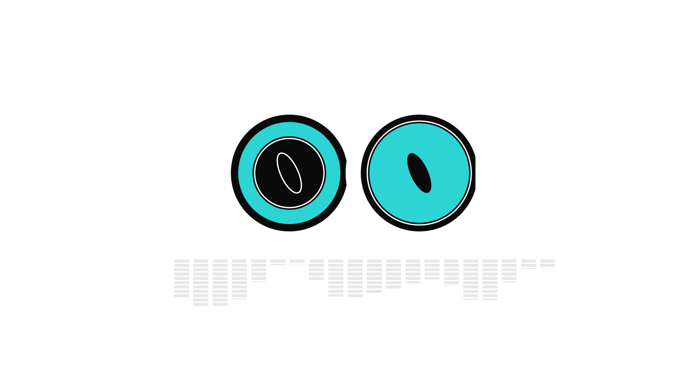
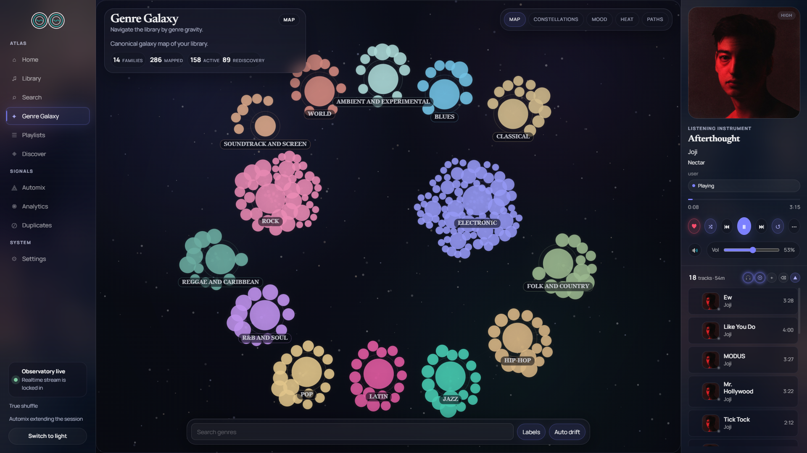

<h1 align="center">




</h1>

<p align="center">A power-user music command center for TIDAL</p>

<p align="center">Incremental sync &nbsp;·&nbsp; Hi-fi playback &nbsp;·&nbsp; Music videos &nbsp;·&nbsp; Genre Galaxy &nbsp;·&nbsp; Spotify discovery &nbsp;·&nbsp; Learning engine</p>

<p align="center"><strong>Latest release:</strong> <a href="../../releases/latest">v0.1.47</a></p>

<p align="center">
  
  
  
  
  
</p>

---

<table>
  <tr>
    <td width="33%"><a href="docs/assets/screenshot-home.png"></a><br/><sub><b>Home</b> - daily picks, new releases, now playing</sub></td>
    <td width="33%"><a href="docs/assets/screenshot-library.png"></a><br/><sub><b>Library</b> - top artist hero, carousels, recent tracks</sub></td>
    <td width="33%"><a href="docs/assets/screenshot-search.png"></a><br/><sub><b>Search</b> - top result card, power filters, queue</sub></td>
  </tr>
  <tr>
    <td width="33%"><a href="docs/assets/screenshot-discover.png"></a><br/><sub><b>Discover</b> - learned recommendations, Sound Space, Song Radio</sub></td>
    <td width="33%"><a href="docs/assets/screenshot-analytics.png"></a><br/><sub><b>Analytics</b> - listening trends, top artists, deep stats</sub></td>
    <td width="33%"><a href="docs/assets/screenshot-automix.png"></a><br/><sub><b>AutoMix</b> - radio-style endless queue with intensity tiers</sub></td>
  </tr>
  <tr>
    <td colspan="3"><a href="docs/assets/screenshot-genregalaxy.png"></a><br/><sub><b>Genre Galaxy</b> - force-directed cosmos for exploring your listening taxonomy</sub></td>
  </tr>
</table>

---

## Features

<details>
<summary><strong>Library</strong> - your entire TIDAL library, synced locally and always fast</summary>

- Full library sync (tracks, albums, artists, playlists) with real-time WebSocket progress, cursor-based incremental refresh, daily auto-sync, and metadata tracking
- **Server-side FTS search** - SQLite FTS5 with prefix-weighted ranking; no preload-all, scales past 10k artists without freezing the UI; sort column applies to results
- Home view: top artist hero card, recently played artist carousel, recently added album shelf, recent tracks
- **Trending shelf** - unified Last.fm + TIDAL chart cards with country and genre scopes, lazy artwork backfill for missing covers, 6-hour shared cache so navigation between pages doesn't refetch
- Artist pages (Spotify/Apple-style): blurred-artwork hero, full TIDAL discography (Albums / Singles & EPs), in-library flags, out-of-library cards linking to TIDAL preview, filter input, Tidal album play overlay
- Album pages: track table, hover-reveal actions, equalizer bar on active row, "More by" shelf
- **Universal track-row hover cluster** - same right-click and inline action menu on every track surface (queue, library, search, discover, playlists, artist/album pages, now-playing)
- **Duplicate detection** page with ISRC matching + title/duration fallback (UI under active polish)
- Bulk operations: add/remove favorites, manage playlists at scale
- Decade strip filter, tile/list toggle, scroll position memory across back-navigation

</details>

<details>
<summary><strong>Search & Command</strong> - plain text, power filters, and intent in one bar</summary>

**Power filter syntax** - combine freely:

```
bpm:>130          energy:>0.8       genre:techno
key:6A            instrumental:true  year:1994
bpm:120-140 genre:house energy:>0.7
```

**Intent parsing:**

```
"play tool"      → plays top match immediately
"radio burial"   → opens Song Radio seeded from Burial
"1994"           → filters library to that year
```

**Special searches:**

```
/vibe         → mood-based cluster search
/underrated   → surfaces buried gems in your library
```

**`Ctrl+K`** / **`⌘K`** - global command palette, reachable from anywhere (including inside Quiet Mode). Slash commands, quick-nav, and per-result action menus (Play now / Play next / Queue / Song radio / Go to artist) without leaving the keyboard. `ArrowRight` on the active row opens the actions menu; clicking the `⋯` icon toggles it.

Recent searches auto-save as clickable chips.

**Search filter grids** - clicking a single-category pill (Artists / Albums / Tracks / Playlists) expands to a multi-row grid instead of a cramped carousel; **All** keeps the horizontal overview carousels.

</details>

<details>
<summary><strong>Playback</strong> - lossless hi-fi, gapless, harmonic Automix</summary>

- Lossless hi-fi streaming via TIDAL with PKCE login, encrypted token storage, automatic token refresh, and **MPEG-DASH segmented streaming** for high-bitrate sources
- **WASAPI exclusive-mode bit-perfect output** (Windows) with quality live-apply, sample-rate-follow, idle device release, and shared-mode fallback
- Audio device enumeration + live device switching (`DeviceSwap` rebuilds the output stream); sample rate follows source on track transition
- Gapless playback: NearEnd event fires 15 s before track end, triggering pre-buffer engine swap for zero-gap transitions
- BPM-aligned crossfade snap and per-track fade-in / fade-out; bit-perfect exclusive mode suppresses crossfade when needed
- Four shuffle modes: off, true (Fisher-Yates), weighted (boosts favorites + never-played), genre-spread (prevents consecutive same-genre runs)
- Automix: automatic queue continuation with Camelot + BPM + energy harmonic multipliers; harmonic match indicators on every queue row
- Now-playing panel shows Camelot wheel key, BPM badge, and full queue
- **Queue redesign**: drag-to-reorder, expanded layout (slim artwork + compact transport), `Q` hotkey to toggle, total-duration formatter, save-as-playlist, clear-with-undo (`Z` within 6 s)
- **Toast-based player error UX** with retry, manual close, and 6 s auto-dismiss

</details>

<details>
<summary><strong>Videos</strong> - search and play TIDAL music videos natively</summary>

- Dedicated **`/videos` page** - search TIDAL's full video catalogue by artist, song, or session type
- Full in-app HTML5 video player powered by hls.js: no redirects, no external browser tabs
- **Quality selector** - Max (highest available) or Adaptive (hls.js ABR); persists across sessions
- **Autoplay** - queues the next search result automatically; an "Up next" pill appears 15 s before the current video ends with the next title
- **Fullscreen** with auto-hiding controls; native HLS fallback for Safari
- **Video mixes** - TIDAL curated video playlists shown as a dedicated **Video Mixes** shelf on the home page (separate from Music Mixes); clicking a card navigates to `/videos`, loads the full playlist, and starts playback immediately
- **Video session panel** - while `/videos` is active the desktop sidebar swaps from the audio now-playing panel to a compact video queue panel showing current artwork, up-next list, and an autoplay toggle; audio mini-player and now-playing sheet are hidden on mobile
- Concurrent audio paused automatically when a video starts to prevent dual playback

</details>

<details>
<summary><strong>Genre Galaxy</strong> - force-directed cosmos of your taxonomy ⚠️ in polish</summary>

> ⚠️ Live but needs polish - several interaction and rendering issues under active work.

- Interactive force-directed canvas of your entire genre taxonomy - 285 genres across 14 families
- Nodes sized and coloured by listen heat; edges drawn by genre co-occurrence
- Drill into any genre: artist cluster view, full track list, per-genre audio metric summary
- **Mix this genre**: loads tracks, shuffles queue, drops you at a random entry point
- **Seed Mix Builder**: blend multiple genres, interleave their tracks, and play
- Four view modes: Heat, Co-occurrence, Cohort, Evolution. Auto-drift pans the canvas

</details>

<details>
<summary><strong>Discover / Sound Space</strong> - learned similarity canvas + Song Radio + intensity-tiered training</summary>

> ⚠️ Work in progress - functional but incomplete. UI and model quality still evolving.

- Force-directed canvas of your library positioned by learned audio similarity
- Hyperspace search: type a mood or reference and fly to the matching cluster
- Nebula halos mark previously explored regions
- **Hover tooltip card** with track preview, audio metric chips, and quick actions
- **Hybrid auto-seed + lock pill**: pin a seed track to keep the canvas focused while you drift
- **Last.fm node resolution state machine** - external recommendations resolve to TIDAL on demand with shimmer / resolved / unavailable states
- **Song Radio**: plays outward from any track using learned neighbor embeddings; creativity slider controls exploration vs. exploitation; honours `seed_tidal_id` for non-library tracks
- Feedback (like, dislike, queue, save) feeds back into the model
- **Prompt Explore**: steer the engine with natural language - mood, reference artist, DJ style
- Embedding pipeline trains on transitions, playlists, albums, genres, and listen sessions; incremental refresh + full retrain with live progress
- **Training intensity tiers** - Max (96d / 64 neighbors / 8-track window), Medium (64d / 32 / 5), Low (48d / 24 / 3, audio-proxy stage skipped). Discovery engine controls live under **Settings → Audio**; the engine remembers
- **Real Stop** - cancel checks live inside every long-running trainer stage, so the Stop button responds within ~1s instead of waiting for the current stage to finish
- **Safety preview** - track count + active intensity → expected wall time + peak RAM + green/amber/red recommendation, blended 70/30 with your last successful run's actual duration
- **Live ETA** - derived from the run's progress + start time, refreshed every WebSocket tick

</details>

<details>
<summary><strong>How discovery works</strong> - when to retrain, what activates a model</summary>

The discovery engine learns a similarity space over your library: every track gets a vector, and each track's top neighbours are pre-computed and stored. Radio, Automix, "more like this", and the discover page all read those neighbours. Until a trained model is active, those surfaces fall back to a metadata-only heuristic (same artist / genre / decade), which is flat - same handful of tracks every time.

**When to retrain**

- First time after syncing your library - there's no model yet.
- After a big sync - new tracks have no neighbours until you retrain.
- After a few weeks of listening - the model improves with real plays. New transitions teach it which tracks belong together.
- You don't need to retrain often. Once a week or so when you've added music or listened a lot. Daily is overkill.

**Incremental refresh vs Full retrain**

*Incremental refresh* reuses the cached audio-proxy features from the last run and only rebuilds the behavioural + similarity stages. Faster - typically 30–50% of a Full Retrain wall-clock. Use this for routine refreshes.

*Full retrain* wipes the audio cache and recomputes everything from scratch. Use this if you've changed intensity tier, suspect the cache is stale, or it's been a long time since the last clean rebuild.

On the very first run there's nothing cached, so both buttons do identical work.

**Intensity tiers**

- **Max** (96-dim, 64 neighbours, 8-track context) - best radio quality, slowest. Recommended for libraries under ~10k or overnight runs.
- **Medium** (64-dim, 32 neighbours, 5-track context) - the default. Indistinguishable from Max for most listening; ~50% of the wall-clock.
- **Low** (48-dim, 24 neighbours, 3-track context) - skips the audio-proxy stage entirely. Cold tracks lose their metadata anchor, but the engine stays usable on modest hardware.

**Why a model might not activate**

A run can complete with full coverage but still leave **Active model** on **Fallback only**. The activation gate scales with how much you've actually listened:

- **0 plays** - needs ≥ 50% coverage. Cold-start mode.
- **1–49 plays** - needs ≥ 70% coverage. Recall@10 isn't reliable on a tiny held-out set, so the gate looks at coverage only.
- **50+ plays** - needs ≥ 85% coverage **AND** ≥ 15% recall@10. Full strict gate.

If you complete a run and the model doesn't activate, you'll usually see Coverage well above the relevant threshold but Active model still says Fallback. That means recall didn't clear - keep listening, retrain again in a week, and the gate will pass naturally.

</details>

<details>
<summary><strong>Radio orchestration</strong> - the thing that picks the next track when Automix or Song Radio is running</summary>

- **Canonical TasteVector** powering both Automix and Song Radio - single scoring model so the two surfaces agree on what "similar" means
- **Genre coherence scoring** via weighted Jaccard against the seed's genre set
- **Engine slot** filled from precomputed `track_similarity` pairs to keep latency low
- **Reason plumbing** through the queue with structured suffix - every queued track carries a human-readable "why is this here?" string
- **Per-edge diagnostics** - every neighbor row carries `confidence`, `support_count`, `candidate_in_degree` (+ percentile), `primary_reason`, plus `play_count_seed`/`candidate`. Per-reason held-out hit-rate persisted to `discovery_diagnostics` so metadata-bonus weights can be calibrated against real predictive value
- **Tier 2 re-ranker (flag-gated)** - source-score normalization (rank + percentile-clipped hybrid), soft confidence penalty, hub penalty using in-degree percentile, constraint-based diversity rerank (artist / album spacing, genre saturation, recent-track skip, penalty relaxation pass), soft source-quota bonus. Each behavior independently toggleable; one-flip kill-switch reverts to the legacy interleave path with no deploy
- **`radio_diagnostics` table** - every queue records target-vs-actual source mix, penalty counts, average confidence + hub percentile, and which flags were active
- **Pending Last.fm rows** - non-library Last.fm radio results queue immediately as pending placeholders and resolve to TIDAL playables in a background pool at play time; aggressive GC keeps the table clean
- Diagnostic harness available as a permanent debug tool for evaluating candidate funnel quality

</details>

<details>
<summary><strong>Smart Features</strong> - DSP analysis, smart playlists, MusicBrainz + Spotify enrichment</summary>

- **Sportify anonymous Spotify proxy** - browse and play any Spotify playlist natively without a Spotify subscription; Spotify→TIDAL track resolution with local metadata caching (tracks, albums, artists, playlists) and a negative-cache to avoid repeated lookup failures; DB migrations 031-032
- **Spotify playlist view** (`/spotify-playlist/[id]`) - full track list with lazy TIDAL artwork resolution, playback via resolved TIDAL IDs, and inline save-to-library actions
- Rule-based smart playlists with AND/OR logic: genre, artist, date range, quality tier, play count, BPM, key, Camelot, energy, danceability, instrumental-only, sample-data presence
- DSP audio analysis runs passively during playback with a user-facing toggle: BPM, key, Camelot, LUFS, energy, danceability, beat strength, spectral centroid, stereo width
- Duplicate detection via ISRC matching with title/duration fallback
- MusicBrainz enrichment (ISRC-first + title fallback, rate-limited); portable MusicBrainz snapshot for offline transfer between installs
- Last.fm genre pipeline: closed taxonomy, orphan-node fix, hierarchy-aware merge; `artist.getsimilar` fallback when track-level recall is empty
- Spotify auth + genre enrichment; auto-migrate legacy tokens
- TIDAL session health: PKCE login, encrypted tokens, pre-request backoff gate, `/api/tidal/status` endpoint, play events fired to `ec.tidal.com`, auto-refresh on 401, `audio_active` flag
- ACRCloud fingerprint sample recognition *(placeholder - not fully functional)*
- Analytics page (recently reimagined): listen history, top tracks/artists, genre heatmap, activity graph, completion rate, skip patterns
- Automix page (recently reimagined): full surface for tuning the harmonic mixing engine

</details>

<details>
<summary><strong>UI & Access</strong> - shaders, Quiet Mode, LAN access, keyboard, Tauri desktop</summary>

- Five GLSL shader wallpapers: Aurora, Chrome, Grid, Nebula, Topo - sidebar and now-playing panel float as glass tiles over them, with a **wallpaper palette system** (Nebula / Verdant / desat variants)
- **Quiet Mode** - fullscreen "just listen" overlay launched from a button on the now-playing artwork. Large artwork + transport, blurred backdrop, body-scroll lock, embedded `⌘K` search pill. Esc cascade is deterministic across the three overlays (action menu → palette → quiet mode).
- 6-digit PIN auth: auto-submits on the sixth digit, numeric keyboard on mobile; local browser auto-connects; legacy tokens auto-migrate on startup
- LAN access: run on one machine, open from any browser on the network; every raw `fetch()` carries the auth header
- WebSocket-driven: playback state, sync progress, queue, training progress push instantly without polling
- Global keyboard shortcuts: `Space` play/pause · `← →` seek · `↑ ↓` volume · `L` like · `S` shuffle · `R` repeat · `Q` toggle queue · `⌘K` / `Ctrl+K` command palette · `Z` undo clear-queue (within 6 s) · `?` shortcuts help popover
- **Tauri desktop app**: system tray menu (network toggle, restart, exit), global media key shortcuts, native window management, **GitHub-releases auto-updater**
- Audio device enumeration and live switching; sample rate follows source on track transition
- WASAPI exclusive-mode bit-perfect output (Windows)
- Dedicated **TIDAL catalogue search** page (`/search`) and TIDAL artist/album profile pages (`/tidal/artists/[id]`, `/tidal/albums/[id]`) for browsing outside your library

</details>

---

## Tech Stack

| Layer | Technology |
|---|---|
| Backend | Rust 2024 edition, Axum 0.8, Rayon |
| Database | SQLite 3 (rusqlite), FTS5, WAL mode |
| Frontend | SvelteKit 2 + Svelte 5 runes, TypeScript, Vite |
| Desktop shell | Tauri 2 |
| Audio decode | Symphonia 0.5 |
| Audio output | CPAL 0.17 (cross-platform) |
| Real-time | Tokio broadcast channel → WebSocket |
| Feed parsing | RSS 2.0 + Atom syndication |

---

## Getting Started

### Download (recommended)

Download the latest portable build from [GitHub Releases](../../releases/latest) - no install required:

| Platform | File | Arch |
|---|---|---|
| Windows | `NOORwave-vX.X.X-windows-x64.zip` | x64 |
| macOS | `NOORwave-vX.X.X-macos-arm64.tar.gz` | Apple Silicon |
| macOS | `NOORwave-vX.X.X-macos-x64.tar.gz` | Intel |
| Linux | `NOORwave-vX.X.X-linux-x64.tar.gz` | x64 |

Every build contains the same three things - keep them together:

```
NOORwave(.exe)     ← desktop shell + system tray
noor-server(.exe)  ← backend, API, audio engine
www/               ← bundled UI  (do not move or delete)
```

Created next to the executables on first run: `noor.db` (library + settings), `noor-server.log`.

---

### Windows

1. Unzip to any folder
2. Double-click `NOORwave.exe`
3. Window opens when the server is ready (~2 s)

The folder is fully relocatable - rename or move it to another drive and it keeps working.

> Windows builds are currently unsigned. On some Windows 11 installs, Smart App Control may block `noor-server.exe`; if that happens, the app window can open but `127.0.0.1:3334` refuses the connection because the local server never started. Advanced workaround: download the source code and run `.\scripts\build-windows11-release.cmd`. This creates `dist\NOORwave-win11\NOORwave.exe`; the result is still unsigned, so strict Smart App Control setups may still block it.

---

### macOS

1. Extract the `.tar.gz`
2. Clear the Gatekeeper quarantine flag (required on first launch):
   ```bash
   xattr -cr NOORwave noor-server
   ```
3. Launch:
   ```bash
   ./NOORwave
   ```

> Gatekeeper blocks unsigned binaries by default. The `xattr -cr` command clears the quarantine flag - it is safe and equivalent to right-clicking → Open in Finder.

---

### Linux

1. Extract the `.tar.gz`
2. Mark the binaries executable:
   ```bash
   chmod +x NOORwave noor-server
   ```
3. Install runtime libraries if missing (Ubuntu / Debian):
   ```bash
   sudo apt-get install libwebkit2gtk-4.1-0 libasound2 libayatana-appindicator3-1
   ```
4. Launch:
   ```bash
   ./NOORwave
   ```

> Fedora / Arch users: install the equivalent `webkitgtk6.0`, `alsa-lib`, and `libayatana-appindicator` packages via your package manager.

---

### Building from source

**Prerequisites:** [Rust](https://rustup.rs/) stable, Node.js 18+, pnpm, a TIDAL account.

**Windows - one-shot build script:**

```powershell
.\scripts\build-portable.ps1
```

Outputs `dist\NOORwave\` ready to run.

**Linux / macOS - manual equivalent:**

```bash
cd frontend && pnpm install && pnpm run build && cd ..
cargo build --release -p noor-server
cargo build --release -p noor-app
mkdir -p dist/NOORwave
cp target/release/noor-{app,server} dist/NOORwave/
mv dist/NOORwave/noor-app dist/NOORwave/NOORwave
cp -r frontend/build dist/NOORwave/www
```

---

### Dev mode (browser UI, fastest iteration)

Runs the backend and frontend separately. The frontend hot-reloads; the Tauri shell is not involved.

```bash
# Terminal 1 - backend
cargo run --release -p noor-server

# Terminal 2 - frontend
cd frontend
pnpm install
pnpm run dev
```

Open `http://localhost:5173`. The frontend connects to the backend on port 3334 automatically.

---

### First Run

1. Open the app - the browser on the server machine auto-connects without a PIN
2. Remote/LAN devices: enter the 6-digit PIN shown in **Settings → Access Token**
3. Complete TIDAL PKCE sign-in in **Settings**
4. Trigger a library sync - progress streams live via WebSocket
5. Start playing

---

### Environment Variables

| Variable | Default | Description |
|---|---|---|
| `NOOR_ADDR` | `0.0.0.0:3334` | Override server bind address |
| `NOOR_DB` | `<exe dir>/noor.db` (workspace root in dev) | Override database path |
| `RUST_LOG` | `noor_server=info` | Log level |
| `TIDAL_PKCE_CLIENT_ID` | *(built-in)* | Override TIDAL PKCE OAuth2 client ID |
| `TIDAL_PKCE_CLIENT_SECRET` | *(built-in)* | Override TIDAL PKCE OAuth2 client secret |

---

## Updating

NOOR doesn't auto-install - it tells you when a new release is out and you swap the portable build yourself. Your library and settings carry over untouched.

### Auto-update notification

On every launch the Tauri shell quietly polls the GitHub Releases API. If a newer tag is available, the system tray menu gains an extra item:

```
↑ vX.Y.Z available - click to download
```

Clicking it opens the GitHub release page in your browser. There is **no silent in-app install**.

### Manual portable swap

Works on every platform:

1. Quit NOORwave
2. Download `NOORwave-vX.Y.Z-<platform>.<ext>` from [Releases](../../releases/latest)
3. Extract over the existing folder, replacing `NOORwave(.exe)`, `noor-server(.exe)`, and `www/`
4. Relaunch

Your library, playlists, settings, PIN, training state, and queue all live in `noor.db` next to the binaries - the swap doesn't touch them.

| Updated by the swap | Preserved across the swap |
|---|---|
| `NOORwave(.exe)` | `noor.db` |
| `noor-server(.exe)` | `noor-server.log` |
| `www/` | TIDAL session, PIN, queue, training state |

### Platform notes

- **macOS** - Gatekeeper quarantines every fresh download. Re-run `xattr -cr NOORwave noor-server` after extracting a new build.
- **Linux** - runtime libraries (`libwebkit2gtk-4.1-0`, `libasound2`, `libayatana-appindicator3-1`) only need to be installed once. Subsequent updates don't require `apt-get` again.
- **Windows** - the folder is fully relocatable; you can extract to a different drive and your old install keeps working until you delete it.

---

## Known Bugs

| Bug | Notes |
|---|---|
| Discover / Sound Space - functional but incomplete | UI and model quality still evolving |
| Song Radio - working but needs tuning | Recommendation quality varies |
| Genre Galaxy - live but rough edges | Several interaction and rendering issues under active work |
| ACRCloud sample recognition | Placeholder - not reliably functional |
| Playlist save failing under certain conditions | Intermittent edge case, reproducing |

---

## Current Limitations

The honest list of what NOOR doesn't do. Some of these are by design, some are not implemented yet, none are reproducible defects (those go in Known Bugs above).

**Streaming sources**

- Requires an active **TIDAL subscription**. HiFi or HiFi Plus is needed for lossless playback; the standard tier streams at AAC quality.
- Spotify integration is **anonymous metadata only**. You can browse and play any Spotify playlist, but every track is resolved to and streamed from TIDAL - there is no native Spotify playback and no Spotify Premium required.
- **YouTube Music** and **SoundCloud** are not implemented. Schema columns and API client stubs exist; resolution logic and routes do not.
- **Beatport** and **Bandcamp** catalogues are not implemented.

**Audio output**

- WASAPI exclusive-mode bit-perfect output is **Windows only**. macOS and Linux fall back to the system mixer (CPAL shared-mode); the OS performs sample-rate conversion.
- Sample-rate-follows-source is Windows-only for the same reason.

**Distribution**

- macOS builds are **unsigned** - Gatekeeper quarantine must be cleared on every download (`xattr -cr`).
- The Tauri auto-updater **notifies, but does not install in-place**. Updates are a manual portable swap (see [Updating](#updating)).
- No mobile app. The LAN UI works in a phone browser but isn't optimised for it.

**Functionality not yet wired**

- ACRCloud fingerprint sample recognition - UI placeholder only.
- Lyrics - no lyrics view in Quiet Mode or anywhere else.
- Offline mode - no cached metadata browsing or local-file playback.
- Playlist export (M3U / JSON) - not implemented.
- Playlist collaboration / public read-only sharing links - not implemented.

**Network**

- LAN access requires both devices on the same network. No tunneling, no remote-internet access by design.

---

## Roadmap

<details>
<summary>What's already shipped ✓ (full list)</summary>

**Recent release highlights**

- [x] **Settings cleanup** - Discovery engine training, intensity, safety preview, progress, and active-model controls now live under Audio instead of a separate top-level Discovery tab (v0.1.44)
- [x] **Incremental TIDAL library sync** - favorite cursors let routine syncs stop once they hit known items, while full sync markers remain intact (v0.1.44)
- [x] **WASAPI exclusive renderer reliability** - format recovery, device-busy retry caps, active-source swapping, idle release, and gapless rules tightened across the exclusive path (v0.1.44)
- [x] **Passive audio-analysis performance** - already-analyzed tracks are skipped before sampling and analysis work is capped during normal playback (v0.1.44)
- [x] **External discovery resolution** - sidecar TIDAL matches can resolve candidate rows without importing unrelated tracks into the main library (v0.1.44)
- [x] **Server route split** - the large route surface is now split into focused analytics, audio-analysis, chart, discovery, duplicates, enrichment, genre, search, Sportify, TIDAL home, and TIDAL sync modules (v0.1.44)
- [x] **TIDAL auth and streaming hardening** - PKCE login, encrypted token storage, returned quality details, lossless DASH streaming, and cleaner external sign-in failures (v0.1.40-v0.1.43)
- [x] **UI zoom and shell polish** - browser-style zoom, Tauri WebView zoom support, shell navigation extraction, player bar extraction, route registry, and layout contract coverage (v0.1.30-v0.1.44)
- [x] **DSP and design-system refresh** - dynamic-programming beat tracking, spectral-flux onset detection, perceptual tempo logic, fluid typography tokens, and the liquid-glass visual system (v0.1.27-v0.1.29)
- [x] **Multi-platform portable releases** - Windows x64, Linux x64, macOS ARM64, and macOS x64 builds ship from GitHub Releases with checksum publishing (v0.1.19-v0.1.44)

**Foundation**

- [x] Discovery engine with embedding-based learning
- [x] Similar Radio with creativity and context controls
- [x] Home page with RSS-driven new releases, daily picks, articles, and news
- [x] Spotify auth and genre enrichment
- [x] Audio feature extraction (BPM, key, energy, danceability via DSP)
- [x] Genre Galaxy visualization with heat, co-occurrence, cohort, and evolution views
- [x] Genre Mix: randomised entry point, seed blend builder
- [x] Discovery Sound Space with hyperspace search and nebula halos
- [x] DSP-powered smart playlist rules (Phase 4 complete)
- [x] Power filter syntax in search
- [x] Last.fm genre pipeline (closed taxonomy, orphan-node fix, hierarchy-aware merge)
- [x] MusicBrainz enrichment (ISRC-first + title fallback, rate-limited); portable snapshot transfer
- [x] Sync metadata tracking + daily auto-sync

**Auth, distribution, infrastructure**

- [x] 6-digit PIN auth with auto-setup for local browsers; legacy-token auto-migration
- [x] Auth header attached to every raw `fetch()` call
- [x] LAN access - open from any device on the network
- [x] Tauri desktop app: system tray (network toggle, restart, exit), global media key shortcuts, native window management
- [x] **GitHub Releases auto-updater** (Tauri shell)
- [x] GitHub Actions release workflow; portable `dist/NOORwave/` Windows build
- [x] SvelteKit `adapter-static` - single bundle served by `noor-server`

**Audio engine**

- [x] WASAPI exclusive-mode bit-perfect output (Windows) with quality live-apply (v0.1.7)
- [x] User-selectable preferred TIDAL quality
- [x] **MPEG-DASH segmented streaming** + DASH XML manifest handling
- [x] Audio device enumeration + `DeviceSwap` rebuild
- [x] `audio_active` flag for output-state tracking
- [x] TIDAL session health: pre-request backoff gate, status endpoint, play events to `ec.tidal.com`, auto-refresh on 401
- [x] Crossfade gain sentinel + per-packet buffer flush (no double fade-in)
- [x] **Equal-power crossfade ramps** (sin² + cos² = 1) eliminate the 3 dB midpoint dip (v0.1.26)
- [x] **Bit-perfect playback path** with onboarding choice - quality vs compatibility prompt on first run (v0.1.26)
- [x] **DSP correctness pass** - 9 audio-analysis bugs fixed, unified STFT, schema v2 bump (v0.1.25)

**Player + queue**

- [x] Automix harmonic mixing (Camelot + BPM + energy multipliers)
- [x] Like button with local + TIDAL sync; optimistic hearts
- [x] Queue redesign: drag-to-reorder, expanded layout (slim artwork + compact transport), `Q` hotkey, total-duration formatter, save-as-playlist, clear-with-undo (`Z` within 6 s)
- [x] Toast-based player error UX with retry, manual close, 6 s auto-dismiss
- [x] Surface radio reasons + shuffle mode labels + action microcopy on every queue row
- [x] Stale `is_playing` cleared on server restart
- [x] External TIDAL queue actions (play next / append) for non-library tracks (v0.1.17)
- [x] Unified playability states across all song cards (search, discover, trending) (v0.1.17)
- [x] Song radio loading toast with proper dismiss on all paths; ephemeral TIDAL queue advance on next_track (v0.1.17)
- [x] Automix suspend for 60 s after manual queue clear (v0.1.17)
- [x] **TIDAL Video Playback** - dedicated `/videos` page: search TIDAL's video catalogue, full in-app HLS player (hls.js), quality selector, autoplay with up-next pill, video mixes shelf, fullscreen, concurrent audio paused on play (v0.1.18)
- [x] **Video session integration** - home page splits Music Mixes and Video Mixes into separate shelves; clicking a video mix card navigates to `/videos` and starts playback automatically; desktop sidebar swaps to a compact video queue panel with up-next list and autoplay toggle during active video sessions; mobile audio chrome hidden during video playback (v0.1.19)
- [x] **Multi-platform releases** - Linux x64, macOS ARM64, macOS x64 portable builds published to GitHub Releases alongside Windows (v0.1.19)
- [x] Song Radio cold-start fallback - when all candidate sources return empty (newly-synced tracks not yet in the learning model), radio now surfaces other tracks by the same artist instead of failing silently (v0.1.18)
- [x] TIDAL Your Mixes token auto-refresh - the shelf no longer loops on 401 errors; refreshes inline like all other TIDAL endpoints (v0.1.18)
- [x] RSS feed fixes - removed defunct Resident Advisor feed; updated Pitchfork and Mixmag to current URLs; fixed Bandcamp Daily parse failure caused by UTF-8 BOM (v0.1.18)
- [x] Play All on TIDAL albums and playlists now plays beyond track 1 (v0.1.26)
- [x] **TIDAL Retry-After honored** + concurrent-request cap to avoid 429 lockouts (v0.1.26)
- [x] Per-album TIDAL sync timeout + retry - sync no longer stalls on slow album lookups (v0.1.26)
- [x] Shuffle bucket randomization + iterated stabilization - genre-spread mode now actually genre-spreads (v0.1.26)
- [x] Shuffle preserves **Off** ordering and drops double artist-spread in Genre mode (v0.1.26)
- [x] Jump within mix when clicking ahead in queue (v0.1.24)
- [x] Drop native confirm on queue clear - undo via `Z` is the safety net (v0.1.24)

**Library + browsing**

- [x] Server-side FTS5 search with prefix-weighted ranking; sort column applied to results
- [x] Spotify/Apple-style artist + album pages with TIDAL discography, blurred-artwork hero, decade strip, tile/list toggle, scroll-position memory
- [x] Filter input + Tidal album play overlay on artist pages
- [x] Dedicated TIDAL catalogue search page (`/search`)
- [x] `/tidal/artists/[id]` and `/tidal/albums/[id]` profile pages
- [x] Search filter grids - single-category pills expand to multi-row grids (Artists 130px, Albums/Tracks/Playlists 180px) (v0.1.17)
- [x] Trending shelf: unified Last.fm + TIDAL charts with country/genre scopes, lazy artwork backfill, 6-hour shared cache, stable shelf layout (v0.1.8)
- [x] **Duplicate detection** page shipped - full UI for scan / groups / resolution
- [x] Reimagined Automix and Analytics pages
- [x] **FTS-first library search** with audio filters; `search_tracks_fts` ORDER BY repaired (v0.1.24)
- [x] **TIDAL catalog search cached server-side** with TTL and offset keying; migration 034 adds `tidal_search_cache` (v0.1.24)
- [x] TIDAL Your Mixes shelf cached for 6 h; refresh on TIDAL connect (v0.1.24)
- [x] Search fan-out - local DB and Sportify in a single `Promise.allSettled` (v0.1.24)
- [x] Reuse a shared `reqwest` client across all TIDAL calls (v0.1.24)
- [x] TIDAL sync hardening - atomicity, reentrancy, error visibility (v0.1.24)
- [x] Search uses pre-built `artwork_url` for TIDAL playlist art - no per-row regeneration (v0.1.24)
- [x] Album search by artist name + shoegaze fuzzy match (v0.1.23)
- [x] macOS layout fix - ShaderWallpaper canvas no longer blocks clicks (v0.1.25)

**Track-row unification (Phase 1–7 frontend overhaul)**

- [x] Universal `<TrackRow>` / `<TidalTrackRow>` components consumed by every track surface
- [x] Inline action parity (right-click + hover cluster) across queue, library, search, discover, playlists, artist/album pages
- [x] Right-click menus on all search sections + Tidal song-radio fallback
- [x] Keyboard shortcut help popover (`?` key) (v0.1.17)

**Discovery + radio**

- [x] Training intensity tiers - Max / Medium / Low - with audio-proxy skip on Low (v0.1.13)
- [x] Mid-stage cancel inside trainer hot loops; Stop button responds within ~1s (v0.1.13)
- [x] Live ETA + safety preview endpoint (track-count-aware cost model, blended with last run's duration) (v0.1.13)
- [x] Per-edge confidence, support, in-degree percentile, primary_reason on neighbor table (v0.1.13)
- [x] Per-reason held-out hit-rate diagnostics persisted to `discovery_diagnostics` (v0.1.13)
- [x] Listen history session_id / source / position / transition_from columns + idempotent backfill (v0.1.13)
- [x] Radio Tier 2 - source-score normalization, confidence + hub penalties, constraint-based diversity rerank, source quota bonus (all flag-gated) + `radio_diagnostics` table (v0.1.13)
- [x] Radio kill-switch flag for one-flip rollback to legacy interleave (v0.1.13)
- [x] Discovery training with cancel-aware hot loop, Stop button, CPU/heat warning
- [x] Hover tooltip card (`DiscoverHoverCard`) with audio metric chips
- [x] Hybrid auto-seed + lock pill; `seed_track_id` drives external Tidal search
- [x] Last.fm node resolution state machine - shimmer / resolved / unavailable
- [x] `cohort` labels, `last_played` / `play_count` / `top_genre` enrichment, `skip_rate` + `completion_avg` aggregates on space nodes
- [x] Reason tags + score components on edges
- [x] Canonical TasteVector adopted by both Automix and Song Radio
- [x] Genre coherence scoring via weighted Jaccard
- [x] Engine slot filled from precomputed `track_similarity` pairs
- [x] Radio reason plumbing through queue with structured suffix
- [x] Pending Last.fm queue rows resolve to TIDAL at play time + background resolver pool + GC
- [x] Radio diagnostic harness as a permanent debug tool
- [x] Radio orchestration: prepend seed track, drop empty-candidates 422 path
- [x] Radio routes ephemeral Tidal tracks to the Tidal-aware path
- [x] Last.fm `artist.getsimilar` fallback when track-level recall is empty
- [x] Last.fm 8 s per-call timeout so a slow tag fetch can't hang the shelf
- [x] **Three-tier activation gate** (0 / 1–49 / 50+ plays) with intra-stage progress and settings guide (v0.1.24)
- [x] **Genre Galaxy display filter** + filter-rescue rule for coverage-poor tracks (v0.1.24)
- [x] **Galaxy "honesty pass"** - modes, panel richness, library filter (v0.1.24)
- [x] Genre fallback cascade - album-then-artist for empty-genre tracks; min_score floor 0.2 → 0.15 (v0.1.24)
- [x] Audio-metrics endpoint + auto-enrich Last.fm / MusicBrainz (v0.1.24)
- [x] MusicBrainz emits `sync_progress` per track so the panel keeps up after navigation (v0.1.24)
- [x] **Discover help panel** - limits, reasons, seed failures, tips (v0.1.26)
- [x] Unstick training, real incremental, correct ETA (v0.1.23)

**UI & accessibility**

- [x] Quiet Mode - fullscreen now-playing overlay with embedded `⌘K` search (v0.1.9)
- [x] `Ctrl+K` / `⌘K` command palette with slash commands and per-row action menus (Play / Queue / Radio / Go to artist|album), keyboard-driven (v0.1.9)
- [x] Three-overlay Esc cascade (action menu → palette → quiet mode) with deterministic z-index ordering (v0.1.9)
- [x] Extracted shared `NowPlayingMetadata` / `Progress` / `Transport` components consumed by desktop panel + mobile sheet + Quiet Mode (v0.1.9)
- [x] Shader wallpapers with glass UI overlay; wallpaper palette system (Nebula / Verdant / desat variants); Google Fonts
- [x] Pending-queue UX polish: spinner artwork + radio loading toast (v0.1.8)
- [x] Manual purge of orphan `tidal_stream` tracks (v0.1.8)
- [x] Codex typography + microcopy pass across pages
- [x] Inline SVG brand mark + favicon
- [x] **Context menu closes on scroll** instead of desyncing from its trigger (v0.1.26)

**Playlists**

- [x] Playlist shuffle, radio, and favorite buttons
- [x] Add-to-playlist context menu on album and artist cards
- [x] Bulk tracks-to-playlist endpoint
- [x] TIDAL playlist search and tracks endpoints (playable inline from search results)
- [x] Inline track-row migration on playlists page
- [x] Sportify - anonymous Spotify metadata proxy; Spotify→TIDAL resolution with local caching; DB migrations 031-032 (v0.1.17)
- [x] Spotify playlist view (`/spotify-playlist`) - browse and play any Spotify playlist via TIDAL resolution (v0.1.17)
- [x] Mosaic playlist covers, click-to-open card, recent-update sort (v0.1.24)

</details>

**Up next:**

- [ ] Tune `RadioProfile` defaults from accumulated `radio_diagnostics` (Tier 2 surgery shipped behind flags)
- [ ] Learned edge scorer to replace hardcoded metadata bonuses (uses `discovery_diagnostics` per-reason hit-rates)
- [ ] Installer build plus signed Tauri updater metadata, while keeping portable releases available
- [ ] Per-bucket TIDAL backoff so one hot endpoint does not block catalog, search, and streaming together
- [ ] Genre Galaxy polish (interaction + rendering issues)
- [ ] Lyrics view inside Quiet Mode
- [ ] Color-sampled dynamic backdrop tint in Quiet Mode
- [ ] ACRCloud fingerprint recognition (currently placeholder)

---

## Reporting a Bug

Open an issue on [GitHub Issues](../../issues) and include:

1. Steps to reproduce
2. Expected behaviour vs what actually happened
3. OS, browser or app version
4. Approximate library size (track count) - helps diagnose sync issues

---

## Disclaimer

NOOR uses TIDAL's unofficial API via a PKCE OAuth2 flow. This project is not affiliated with, endorsed by, or associated with TIDAL Music AS or MQA Ltd. Use is at your own discretion and risk. Credentials are stored locally, AES-GCM encrypted in the SQLite database. NOOR is intended for personal use only.

---

## License

[MIT](LICENSE)

---

<details>
<summary><strong>Maintainer notes</strong> - keeping the README current</summary>

A convention so the bug list, roadmap, and limitations don't drift. Future-me, this is for you.

### Section semantics

- **Features** - present-tense capabilities only. If you can't run it today, it doesn't go here.
- **Known Bugs** - reproducible defects on the current version only. If it's intentional or unimplemented, it lives in **Current Limitations** instead.
- **Current Limitations** - by-design constraints AND unimplemented integrations. The "won't fix soon" pile.
- **Roadmap → Up next** - actively planned with intent to land in the next few releases. Speculative items don't go here; they belong in **Current Limitations** under "Functionality not yet wired".
- **Roadmap → What's already shipped** - every entry tagged with the `(vX.Y.Z)` it shipped in.

### On every release tag

1. Bump versions in [noor-server/Cargo.toml](noor-server/Cargo.toml), [noor-app/Cargo.toml](noor-app/Cargo.toml), [noor-app/tauri.conf.json](noor-app/tauri.conf.json) - refresh `Cargo.lock`.
2. For each closed bug since the last tag: remove the row from **Known Bugs**, add a bullet to **What's already shipped** with `(vX.Y.Z)`.
3. For each shipped roadmap item: remove from **Up next**, add to **What's already shipped** with `(vX.Y.Z)`.
4. Adjust **Current Limitations** as constraints change - when ACRCloud is wired, move it from "Functionality not yet wired" into a Features bullet; when Linux gets a bit-perfect output path, qualify the WASAPI line; etc.
5. Keep the Windows 11 Smart App Control note in the release boilerplate. If Windows signing is added later, update both the release workflow body and the Windows section above.
6. After `git tag` + `git push --tags`: `gh release edit vX.Y.Z` to prepend a "What's new" section to the auto-generated release body. CI only emits portable-build boilerplate.

### Verification before declaring a section accurate

- **Bug status** - `git log v<prev>..HEAD --oneline | grep -i <keyword>`. If a closing commit exists, the bug is closed.
- **Roadmap status** - same query. If shipped, move it.
- **Features** - confirm the route or code path actually exists. Don't trust memory.
- **Versions** - every `(vX.Y.Z)` tag in **What's already shipped** must match an entry in `git tag -l`.

</details>
