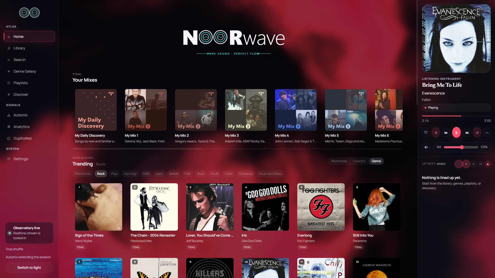
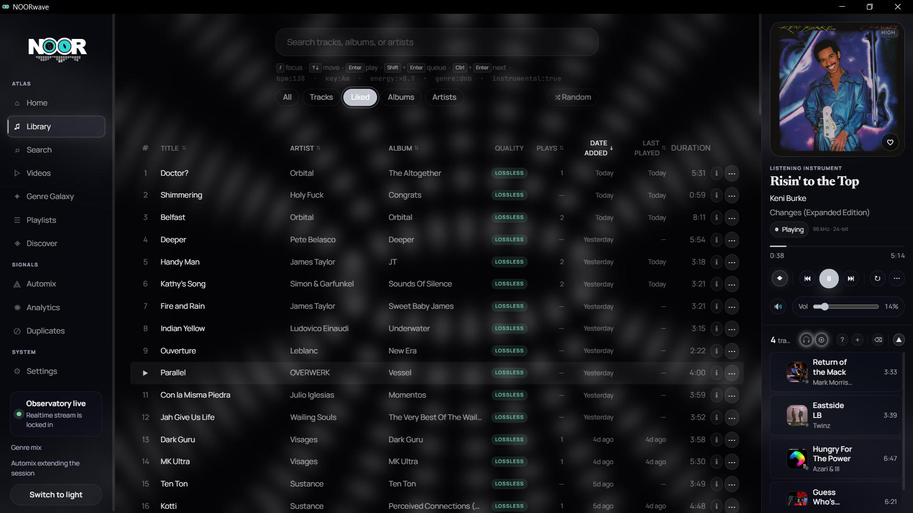
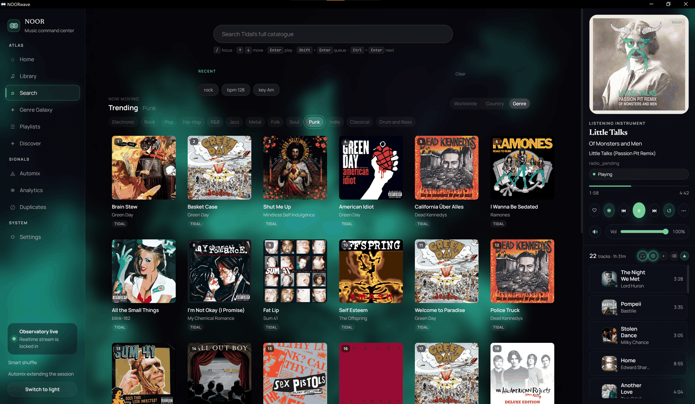
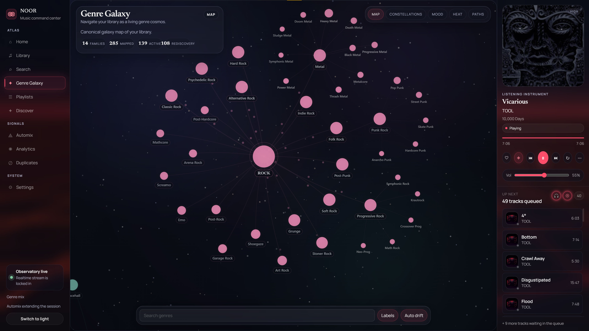
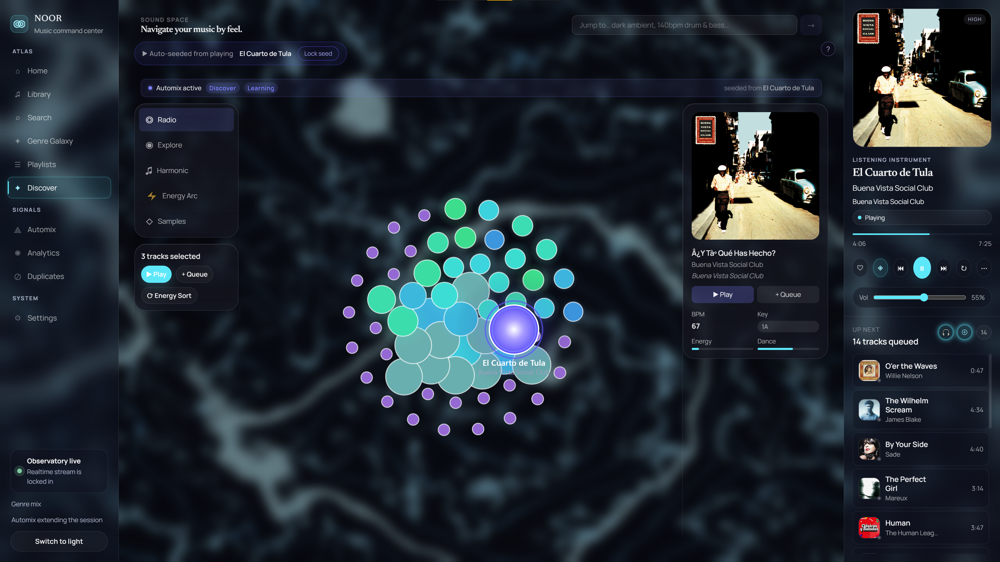

<h1 align="center">NOOR</h1>

<p align="center">A power-user music command center for TIDAL</p>

<p align="center">Local sync &nbsp;·&nbsp; Hi-fi playback &nbsp;·&nbsp; Genre Galaxy &nbsp;·&nbsp; Learning discovery engine</p>

<p align="center">
  
  
  
  
  
</p>

---

<table>
  <tr>
    <td width="33%"><br/><sub><b>Home</b> — daily picks, new releases, now playing</sub></td>
    <td width="33%"><br/><sub><b>Library</b> — top artist hero, carousels, recent tracks</sub></td>
    <td width="33%"><br/><sub><b>Search</b> — top result card, power filters, queue</sub></td>
  </tr>
  <tr>
    <td width="33%"><br/><sub><b>Genre Galaxy</b> — force-directed genre cosmos</sub></td>
    <td width="33%"><br/><sub><b>Discover</b> — learned audio similarity canvas</sub></td>
    <td width="33%" align="center"><br/><br/><sub>more screenshots coming</sub></td>
  </tr>
</table>

---

## Features

### Library

Your entire TIDAL library, synced locally and always fast.

- Full library sync (tracks, albums, artists, playlists) with real-time WebSocket progress
- Home view: top artist hero card, recently played artist carousel, recently added album shelf, recent tracks
- Artist pages: blurred-artwork hero, full TIDAL discography (Albums / Singles & EPs), in-library flags, out-of-library cards linking to TIDAL preview
- Album pages: track table, hover-reveal actions, equalizer bar on active row, "More by" shelf
- Bulk operations: add/remove favorites, manage playlists at scale
- Decade strip filter, tile/list toggle, scroll position memory across back-navigation

---

### Search & Command

Search understands plain text, power filters, and intent in the same bar.

**Power filter syntax** — combine freely:

```
bpm:>130          energy:>0.8       genre:techno
key:6A            instrumental:true  year:1994
bpm:120-140 genre:house energy:>0.7
```

**Intent parsing:**

```
"play tool"      → plays top match immediately
"radio burial"   → opens Song Radio seeded from Burial
"1994"           → filters library to that year
```

**Special searches:**

```
/vibe         → mood-based cluster search
/underrated   → surfaces buried gems in your library
```

**`Ctrl+K`** — global command palette. Slash commands, quick-nav, and actions without leaving the keyboard.

Recent searches auto-save as clickable chips.

---

### Playback

- Lossless hi-fi streaming via TIDAL with automatic token refresh
- Gapless playback: NearEnd event fires 15 s before track end, triggering pre-buffer engine swap for zero-gap transitions
- BPM-aligned crossfade snap and per-track fade-in / fade-out
- Four shuffle modes: off, true (Fisher-Yates), weighted (boosts favorites + never-played), genre-spread (prevents consecutive same-genre runs)
- Automix: automatic queue continuation with Camelot + BPM + energy harmonic multipliers; harmonic match indicators on every queue row
- Now-playing panel shows Camelot wheel key, BPM badge, and full queue

---

### Genre Galaxy

> ⚠️ Live but needs polish — several interaction and rendering issues under active work.

- Interactive force-directed canvas of your entire genre taxonomy — 285 genres across 14 families
- Nodes sized and coloured by listen heat; edges drawn by genre co-occurrence
- Drill into any genre: artist cluster view, full track list, per-genre audio metric summary
- **Mix this genre**: loads tracks, shuffles queue, drops you at a random entry point
- **Seed Mix Builder**: blend multiple genres, interleave their tracks, and play
- Four view modes: Heat, Co-occurrence, Cohort, Evolution. Auto-drift pans the canvas

---

### Discover / Sound Space

> ⚠️ Work in progress — functional but incomplete. UI and model quality still evolving.

- Force-directed canvas of your library positioned by learned audio similarity
- Hyperspace search: type a mood or reference and fly to the matching cluster
- Nebula halos mark previously explored regions
- **Song Radio**: plays outward from any track using learned neighbor embeddings; creativity slider controls exploration vs. exploitation
- Feedback (like, dislike, queue, save) feeds back into the model
- **Prompt Explore**: steer the engine with natural language — mood, reference artist, DJ style
- Embedding pipeline trains on transitions, playlists, albums, genres, and listen sessions; incremental refresh + full retrain with live progress and cancel button

---

### Smart Features

- Rule-based smart playlists with AND/OR logic: genre, artist, date range, quality tier, play count, BPM, key, Camelot, energy, danceability, instrumental-only, sample-data presence
- DSP audio analysis runs passively during playback: BPM, key, Camelot, LUFS, energy, danceability, beat strength, spectral centroid, stereo width
- Duplicate detection via ISRC matching with title/duration fallback
- MusicBrainz enrichment (ISRC-first + title fallback, rate-limited)
- Last.fm genre pipeline: closed taxonomy + hierarchy-aware merge
- ACRCloud fingerprint sample recognition *(placeholder — not fully functional)*
- Analytics: listen history, top tracks/artists, genre heatmap, activity graph, completion rate, skip patterns

---

### UI & Access

- Five GLSL shader wallpapers: Aurora, Chrome, Grid, Nebula, Topo — sidebar and now-playing panel float as glass tiles over them
- 6-digit PIN auth: auto-submits on the sixth digit, numeric keyboard on mobile; local browser auto-connects
- LAN access: run on one machine, open from any browser on the network
- WebSocket-driven: playback state, sync progress, queue, training progress push instantly without polling
- Global keyboard shortcuts: `Space` play/pause · `← →` seek · `↑ ↓` volume · `L` like · `S` shuffle · `R` repeat
- **Tauri desktop app**: system tray menu (network toggle, restart, exit), global media key shortcuts, native window management
- Audio device enumeration and switching; sample rate follows source on track transition

---

## Tech Stack

| Layer | Technology |
|---|---|
| Backend | Rust 2024 edition, Axum 0.8, Rayon |
| Database | SQLite 3 (rusqlite), FTS5, WAL mode |
| Frontend | SvelteKit 2 + Svelte 5 runes, TypeScript, Vite |
| Desktop shell | Tauri 2 |
| Audio decode | Symphonia 0.5 |
| Audio output | CPAL 0.15 (cross-platform) |
| Real-time | Tokio broadcast channel → WebSocket |
| Feed parsing | RSS 2.0 + Atom syndication |

---

## Getting Started

### Prerequisites

- [Rust](https://rustup.rs/) stable toolchain (install via `rustup`)
- Node.js 18+ and npm
- A TIDAL account

---

**Windows portable — no install required. Unzip anywhere and run NOORwave.exe.**

### Contents
- `NOORwave.exe` — app window + system tray
- `noor-server.exe` — local music server  
- `www/` — bundled UI (do not delete)

### Usage
1. Unzip to any folder
2. Double-click `NOORwave.exe`
3. Window opens when server is ready (~2s)

### Option A — Portable build (Windows, recommended)

Produces a self-contained `dist\NOORwave\` folder with two executables and the built frontend. Run once from the workspace root:

```powershell
.\scripts\build-portable.ps1
```

What the script does:
1. `npm run build` in `frontend/` → static site in `frontend\build\`
2. `cargo build --release -p noor-server` → `target\release\noor-server.exe`
3. `cargo build --release -p noor-app` → `target\release\noor-app.exe`
4. Assembles `dist\NOORwave\`:
   ```
   dist\NOORwave\
     NOORwave.exe       ← Tauri desktop shell
     noor-server.exe    ← backend + API server
     www\               ← built frontend (served by noor-server on :3334)
   ```

Then launch `dist\NOORwave\NOORwave.exe`. The Tauri shell spawns `noor-server.exe` automatically and shows the window once the server is ready.

> **Note:** All three artifacts must be in the same folder. Copying only the exe files without `www\` will result in a blank window.

---

### Option B — Dev mode (browser UI, fastest iteration)

Runs the backend and frontend separately. The frontend hot-reloads; the Tauri shell is not involved.

```bash
# Terminal 1 — backend
cargo run --release -p noor-server

# Terminal 2 — frontend
cd frontend
npm install
npm run dev
```

Open `http://localhost:5173`. The frontend connects to the backend on port 3334 automatically.

---

### First Run

1. Open the app — the browser on the server machine auto-connects without a PIN
2. Remote/LAN devices: enter the 6-digit PIN shown in **Settings → Access Token**
3. Complete TIDAL device-code auth in **Settings**
4. Trigger a library sync — progress streams live via WebSocket
5. Start playing

---

### Environment Variables

| Variable | Default | Description |
|---|---|---|
| `NOOR_ADDR` | `0.0.0.0:3334` | Override server bind address |
| `NOOR_DB` | `<exe dir>/noor.db` | Override database path |
| `RUST_LOG` | `noor_server=info` | Log level |
| `TIDAL_CLIENT_ID` | *(built-in)* | Override TIDAL OAuth2 client ID |
| `TIDAL_CLIENT_SECRET` | *(built-in)* | Override TIDAL OAuth2 client secret |

---

## Known Bugs

### In Progress

| Bug | Status |
|---|---|
| Gapless audio blend — pre-buffer engine swap works; audio-level crossfade mixing pending | In progress |
| Discover / Sound Space — functional but incomplete; UI and model quality still evolving | In progress |
| Song Radio — working but needs tuning; recommendation quality varies | In progress |
| Genre Galaxy — live but several interaction and rendering issues under active work | In progress |

### Reported / Queued

| Bug | Notes |
|---|---|
| Duplicate detection UI missing | Backend detection logic complete; UI not yet wired |
| WASAPI exclusive mode | Code path scaffolded; low-latency buffer pending cpal upgrade |
| ACRCloud sample recognition | Mostly placeholder; not reliably functional |
| Playlist save failing under certain conditions | Edge case — reproducing intermittently |
| Shuffle genre-spread not always respected | Algorithm issue under investigation |
| Context menus disappear on scroll | Known UI bug |
| Library sync stalls on very large libraries | Likely a pagination or timeout issue |

---

## Roadmap

<details>
<summary>What's already shipped ✓</summary>

- [x] Discovery engine with embedding-based learning
- [x] Similar Radio with creativity and context controls
- [x] Home page with RSS-driven new releases, daily picks, articles, and news
- [x] Spotify auth and genre enrichment
- [x] Audio feature extraction (BPM, key, energy, danceability via DSP)
- [x] Genre Galaxy visualization with heat, co-occurrence, cohort, and evolution views
- [x] Genre Mix: randomised entry point, seed blend builder
- [x] Discovery Sound Space with hyperspace search and nebula halos
- [x] 6-digit PIN auth with auto-setup for local browsers
- [x] Automix harmonic mixing (Camelot + BPM + energy multipliers)
- [x] Artist and album pages with TIDAL discography
- [x] Shader wallpapers with glass UI overlay
- [x] DSP-powered smart playlist rules
- [x] Ctrl+K command palette with slash commands
- [x] Power filter syntax in search
- [x] Tauri desktop app with tray menu and media keys
- [x] Last.fm genre pipeline (closed taxonomy + hierarchy-aware merge)

</details>

**Up next:**

- [ ] Gapless crossfade audio blend (audio-level mixing)
- [ ] Duplicate detection UI
- [ ] WASAPI exclusive mode
- [ ] Song Radio tuning
- [ ] Genre Galaxy polish
- [ ] YouTube Music integration
- [ ] SoundCloud integration
- [ ] Tauri auto-updater

---

## Reporting a Bug

Open an issue on [GitHub Issues](../../issues) and include:

1. Steps to reproduce
2. Expected behaviour vs what actually happened
3. OS, browser or app version
4. Approximate library size (track count) — helps diagnose sync issues

---

## Future Plans

Beyond the current roadmap:

- Full YouTube Music and SoundCloud integration
- Playlist collaboration and export (M3U, JSON)
- Mobile-optimised LAN UI
- Beatport / Bandcamp integration
- Public read-only library sharing link
- Offline mode: cached metadata + local file playback

---

## Disclaimer

NOOR uses TIDAL's unofficial API via a device-code OAuth2 flow — the same mechanism used by other third-party TIDAL clients. This project is not affiliated with, endorsed by, or associated with TIDAL Music AS or MQA Ltd. Use is at your own discretion and risk. Credentials are stored locally, AES-GCM encrypted in the SQLite database. NOOR is intended for personal use only.

---

## License

[MIT](LICENSE)
