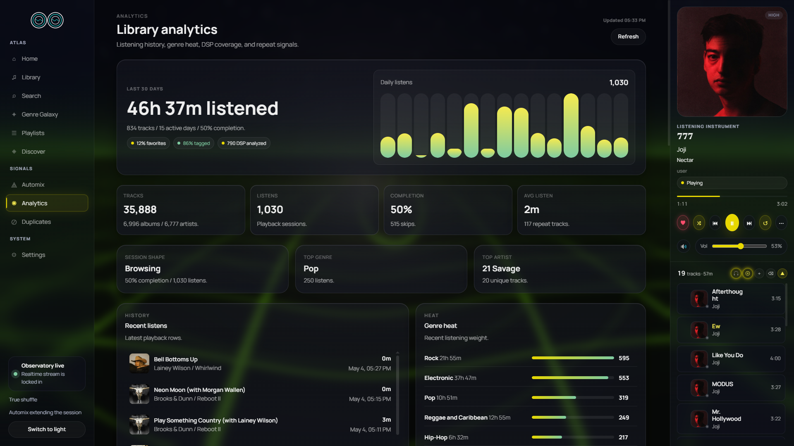
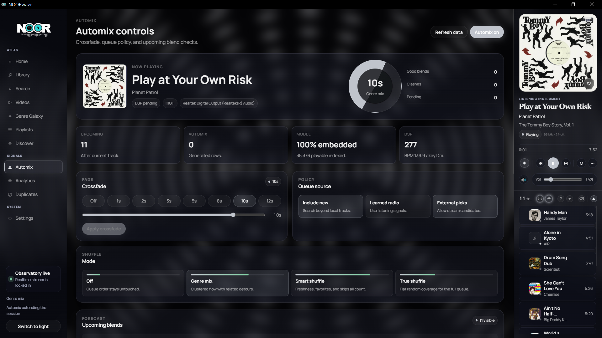

<h1 align="center">
</h1>

<p align="center">A power-user music command center for TIDAL</p>

<p align="center">Local sync &nbsp;·&nbsp; Hi-fi playback &nbsp;·&nbsp; Genre Galaxy &nbsp;·&nbsp; Learning discovery engine</p>

<p align="center">
  
  
  
  
  
</p>

---

<table>
  <tr>
    <td width="33%"><br/><sub><b>Home</b> — daily picks, new releases, now playing</sub></td>
    <td width="33%"><br/><sub><b>Library</b> — top artist hero, carousels, recent tracks</sub></td>
    <td width="33%"><br/><sub><b>Search</b> — top result card, power filters, queue</sub></td>
  </tr>
  <tr>
    <td width="33%"><br/><sub><b>Analytics</b> — listening trends, top artists, deep stats</sub></td>
    <td width="33%"><br/><sub><b>AutoMix</b> — radio-style endless queue with intensity tiers</sub></td>
    <td width="33%" align="center"><br/><br/><sub>more screenshots coming</sub></td>
  </tr>
</table>

---

## Features

<details>
<summary><strong>Library</strong> — your entire TIDAL library, synced locally and always fast</summary>

- Full library sync (tracks, albums, artists, playlists) with real-time WebSocket progress; daily auto-sync with metadata tracking
- **Server-side FTS search** — SQLite FTS5 with prefix-weighted ranking; no preload-all, scales past 10k artists without freezing the UI; sort column applies to results
- Home view: top artist hero card, recently played artist carousel, recently added album shelf, recent tracks
- **Trending shelf** — unified Last.fm + TIDAL chart cards with country and genre scopes, lazy artwork backfill for missing covers, 6-hour shared cache so navigation between pages doesn't refetch
- Artist pages (Spotify/Apple-style): blurred-artwork hero, full TIDAL discography (Albums / Singles & EPs), in-library flags, out-of-library cards linking to TIDAL preview, filter input, Tidal album play overlay
- Album pages: track table, hover-reveal actions, equalizer bar on active row, "More by" shelf
- **Universal track-row hover cluster** — same right-click and inline action menu on every track surface (queue, library, search, discover, playlists, artist/album pages, now-playing)
- **Duplicate detection** page with ISRC matching + title/duration fallback (UI under active polish)
- Bulk operations: add/remove favorites, manage playlists at scale
- Decade strip filter, tile/list toggle, scroll position memory across back-navigation

</details>

<details>
<summary><strong>Search & Command</strong> — plain text, power filters, and intent in one bar</summary>

**Power filter syntax** — combine freely:

```
bpm:>130          energy:>0.8       genre:techno
key:6A            instrumental:true  year:1994
bpm:120-140 genre:house energy:>0.7
```

**Intent parsing:**

```
"play tool"      → plays top match immediately
"radio burial"   → opens Song Radio seeded from Burial
"1994"           → filters library to that year
```

**Special searches:**

```
/vibe         → mood-based cluster search
/underrated   → surfaces buried gems in your library
```

**`Ctrl+K`** / **`⌘K`** — global command palette, reachable from anywhere (including inside Quiet Mode). Slash commands, quick-nav, and per-result action menus (Play now / Play next / Queue / Song radio / Go to artist) without leaving the keyboard. `ArrowRight` on the active row opens the actions menu; clicking the `⋯` icon toggles it.

Recent searches auto-save as clickable chips.

</details>

<details>
<summary><strong>Playback</strong> — lossless hi-fi, gapless, harmonic Automix</summary>

- Lossless hi-fi streaming via TIDAL with automatic token refresh, **MPEG-DASH segmented streaming** for high-bitrate sources
- **WASAPI exclusive-mode bit-perfect output** (Windows) with quality live-apply; user-selectable preferred TIDAL quality
- Audio device enumeration + live device switching (`DeviceSwap` rebuilds the output stream); sample rate follows source on track transition
- Gapless playback: NearEnd event fires 15 s before track end, triggering pre-buffer engine swap for zero-gap transitions
- BPM-aligned crossfade snap and per-track fade-in / fade-out
- Four shuffle modes: off, true (Fisher-Yates), weighted (boosts favorites + never-played), genre-spread (prevents consecutive same-genre runs)
- Automix: automatic queue continuation with Camelot + BPM + energy harmonic multipliers; harmonic match indicators on every queue row
- Now-playing panel shows Camelot wheel key, BPM badge, and full queue
- **Queue redesign**: drag-to-reorder, expanded layout (slim artwork + compact transport), `Q` hotkey to toggle, total-duration formatter, save-as-playlist, clear-with-undo (`Z` within 6 s)
- **Toast-based player error UX** with retry, manual close, and 6 s auto-dismiss

</details>

<details>
<summary><strong>Genre Galaxy</strong> — force-directed cosmos of your taxonomy ⚠️ in polish</summary>

> ⚠️ Live but needs polish — several interaction and rendering issues under active work.

- Interactive force-directed canvas of your entire genre taxonomy — 285 genres across 14 families
- Nodes sized and coloured by listen heat; edges drawn by genre co-occurrence
- Drill into any genre: artist cluster view, full track list, per-genre audio metric summary
- **Mix this genre**: loads tracks, shuffles queue, drops you at a random entry point
- **Seed Mix Builder**: blend multiple genres, interleave their tracks, and play
- Four view modes: Heat, Co-occurrence, Cohort, Evolution. Auto-drift pans the canvas

</details>

<details>
<summary><strong>Discover / Sound Space</strong> — learned similarity canvas + Song Radio + intensity-tiered training</summary>

> ⚠️ Work in progress — functional but incomplete. UI and model quality still evolving.

- Force-directed canvas of your library positioned by learned audio similarity
- Hyperspace search: type a mood or reference and fly to the matching cluster
- Nebula halos mark previously explored regions
- **Hover tooltip card** with track preview, audio metric chips, and quick actions
- **Hybrid auto-seed + lock pill**: pin a seed track to keep the canvas focused while you drift
- **Last.fm node resolution state machine** — external recommendations resolve to TIDAL on demand with shimmer / resolved / unavailable states
- **Song Radio**: plays outward from any track using learned neighbor embeddings; creativity slider controls exploration vs. exploitation; honours `seed_tidal_id` for non-library tracks
- Feedback (like, dislike, queue, save) feeds back into the model
- **Prompt Explore**: steer the engine with natural language — mood, reference artist, DJ style
- Embedding pipeline trains on transitions, playlists, albums, genres, and listen sessions; incremental refresh + full retrain with live progress
- **Training intensity tiers** — Max (96d / 64 neighbors / 8-track window), Medium (64d / 32 / 5), Low (48d / 24 / 3, audio-proxy stage skipped). Pick once in Settings; the engine remembers
- **Real Stop** — cancel checks live inside every long-running trainer stage, so the Stop button responds within ~1s instead of waiting for the current stage to finish
- **Safety preview** — track count + active intensity → expected wall time + peak RAM + green/amber/red recommendation, blended 70/30 with your last successful run's actual duration
- **Live ETA** — derived from the run's progress + start time, refreshed every WebSocket tick

</details>

<details>
<summary><strong>Radio orchestration</strong> — the thing that picks the next track when Automix or Song Radio is running</summary>

- **Canonical TasteVector** powering both Automix and Song Radio — single scoring model so the two surfaces agree on what "similar" means
- **Genre coherence scoring** via weighted Jaccard against the seed's genre set
- **Engine slot** filled from precomputed `track_similarity` pairs to keep latency low
- **Reason plumbing** through the queue with structured suffix — every queued track carries a human-readable "why is this here?" string
- **Per-edge diagnostics** — every neighbor row carries `confidence`, `support_count`, `candidate_in_degree` (+ percentile), `primary_reason`, plus `play_count_seed`/`candidate`. Per-reason held-out hit-rate persisted to `discovery_diagnostics` so metadata-bonus weights can be calibrated against real predictive value
- **Tier 2 re-ranker (flag-gated)** — source-score normalization (rank + percentile-clipped hybrid), soft confidence penalty, hub penalty using in-degree percentile, constraint-based diversity rerank (artist / album spacing, genre saturation, recent-track skip, penalty relaxation pass), soft source-quota bonus. Each behavior independently toggleable; one-flip kill-switch reverts to the legacy interleave path with no deploy
- **`radio_diagnostics` table** — every queue records target-vs-actual source mix, penalty counts, average confidence + hub percentile, and which flags were active
- **Pending Last.fm rows** — non-library Last.fm radio results queue immediately as pending placeholders and resolve to TIDAL playables in a background pool at play time; aggressive GC keeps the table clean
- Diagnostic harness available as a permanent debug tool for evaluating candidate funnel quality

</details>

<details>
<summary><strong>Smart Features</strong> — DSP analysis, smart playlists, MusicBrainz + Spotify enrichment</summary>

- Rule-based smart playlists with AND/OR logic: genre, artist, date range, quality tier, play count, BPM, key, Camelot, energy, danceability, instrumental-only, sample-data presence
- DSP audio analysis runs passively during playback: BPM, key, Camelot, LUFS, energy, danceability, beat strength, spectral centroid, stereo width
- Duplicate detection via ISRC matching with title/duration fallback
- MusicBrainz enrichment (ISRC-first + title fallback, rate-limited); portable MusicBrainz snapshot for offline transfer between installs
- Last.fm genre pipeline: closed taxonomy, orphan-node fix, hierarchy-aware merge; `artist.getsimilar` fallback when track-level recall is empty
- Spotify auth + genre enrichment; auto-migrate legacy tokens
- TIDAL session health: pre-request backoff gate, `/api/tidal/status` endpoint, play events fired to `ec.tidal.com`, auto-refresh on 401, `audio_active` flag
- ACRCloud fingerprint sample recognition *(placeholder — not fully functional)*
- Analytics page (recently reimagined): listen history, top tracks/artists, genre heatmap, activity graph, completion rate, skip patterns
- Automix page (recently reimagined): full surface for tuning the harmonic mixing engine

</details>

<details>
<summary><strong>UI & Access</strong> — shaders, Quiet Mode, LAN access, keyboard, Tauri desktop</summary>

- Five GLSL shader wallpapers: Aurora, Chrome, Grid, Nebula, Topo — sidebar and now-playing panel float as glass tiles over them, with a **wallpaper palette system** (Nebula / Verdant / desat variants)
- **Quiet Mode** — fullscreen "just listen" overlay launched from a button on the now-playing artwork. Large artwork + transport, blurred backdrop, body-scroll lock, embedded `⌘K` search pill. Esc cascade is deterministic across the three overlays (action menu → palette → quiet mode).
- 6-digit PIN auth: auto-submits on the sixth digit, numeric keyboard on mobile; local browser auto-connects; legacy tokens auto-migrate on startup
- LAN access: run on one machine, open from any browser on the network; every raw `fetch()` carries the auth header
- WebSocket-driven: playback state, sync progress, queue, training progress push instantly without polling
- Global keyboard shortcuts: `Space` play/pause · `← →` seek · `↑ ↓` volume · `L` like · `S` shuffle · `R` repeat · `Q` toggle queue · `⌘K` / `Ctrl+K` command palette · `Z` undo clear-queue (within 6 s)
- **Tauri desktop app**: system tray menu (network toggle, restart, exit), global media key shortcuts, native window management, **GitHub-releases auto-updater**
- Audio device enumeration and live switching; sample rate follows source on track transition
- WASAPI exclusive-mode bit-perfect output (Windows)
- Dedicated **TIDAL catalogue search** page (`/search`) and TIDAL artist/album profile pages (`/tidal/artists/[id]`, `/tidal/albums/[id]`) for browsing outside your library

</details>

---

## Tech Stack

| Layer | Technology |
|---|---|
| Backend | Rust 2024 edition, Axum 0.8, Rayon |
| Database | SQLite 3 (rusqlite), FTS5, WAL mode |
| Frontend | SvelteKit 2 + Svelte 5 runes, TypeScript, Vite |
| Desktop shell | Tauri 2 |
| Audio decode | Symphonia 0.5 |
| Audio output | CPAL 0.15 (cross-platform) |
| Real-time | Tokio broadcast channel → WebSocket |
| Feed parsing | RSS 2.0 + Atom syndication |

---

## Getting Started

### Prerequisites

- [Rust](https://rustup.rs/) stable toolchain (install via `rustup`)
- Node.js 18+ and npm
- A TIDAL account

---

**Windows portable — no install required. Unzip anywhere and run NOORwave.exe.**

### Contents
- `NOORwave.exe` — app window + system tray
- `noor-server.exe` — local music server
- `www/` — bundled UI (do not delete)

Created next to the exes on first run:
- `noor.db` (+ `noor.db-wal`, `noor.db-shm`) — your library, settings, and TIDAL session
- `noor-server.log` — server output

### Usage
1. Unzip to any folder
2. Double-click `NOORwave.exe`
3. Window opens when server is ready (~2s)

The folder is fully relocatable — drag `NOORwave\` to a different drive or rename the parent and it keeps working, as long as the contents stay together.

### Option A — Portable build (Windows, recommended)

Produces a self-contained `dist\NOORwave\` folder with two executables and the built frontend. Run once from the workspace root:

```powershell
.\scripts\build-portable.ps1
```

What the script does:
1. `npm run build` in `frontend/` → static site in `frontend\build\`
2. `cargo build --release -p noor-server` → `target\release\noor-server.exe`
3. `cargo build --release -p noor-app` → `target\release\noor-app.exe`
4. Assembles `dist\NOORwave\`:
   ```
   dist\NOORwave\
     NOORwave.exe       ← Tauri desktop shell
     noor-server.exe    ← backend + API server
     www\               ← built frontend (served by noor-server on :3334)
   ```

Then launch `dist\NOORwave\NOORwave.exe`. The Tauri shell spawns `noor-server.exe` automatically and shows the window once the server is ready.

> **Note:** All three artifacts must be in the same folder. Copying only the exe files without `www\` will result in a blank window.

---

### Option B — Dev mode (browser UI, fastest iteration)

Runs the backend and frontend separately. The frontend hot-reloads; the Tauri shell is not involved.

```bash
# Terminal 1 — backend
cargo run --release -p noor-server

# Terminal 2 — frontend
cd frontend
npm install
npm run dev
```

Open `http://localhost:5173`. The frontend connects to the backend on port 3334 automatically.

---

### First Run

1. Open the app — the browser on the server machine auto-connects without a PIN
2. Remote/LAN devices: enter the 6-digit PIN shown in **Settings → Access Token**
3. Complete TIDAL device-code auth in **Settings**
4. Trigger a library sync — progress streams live via WebSocket
5. Start playing

---

### Environment Variables

| Variable | Default | Description |
|---|---|---|
| `NOOR_ADDR` | `0.0.0.0:3334` | Override server bind address |
| `NOOR_DB` | `<exe dir>/noor.db` (workspace root in dev) | Override database path |
| `RUST_LOG` | `noor_server=info` | Log level |
| `TIDAL_CLIENT_ID` | *(built-in)* | Override TIDAL OAuth2 client ID |
| `TIDAL_CLIENT_SECRET` | *(built-in)* | Override TIDAL OAuth2 client secret |

---

## Known Bugs

### In Progress

| Bug | Status |
|---|---|
| Gapless audio blend — pre-buffer engine swap works; audio-level crossfade mixing pending | In progress |
| Discover / Sound Space — functional but incomplete; UI and model quality still evolving | In progress |
| Song Radio — working but needs tuning; recommendation quality varies | In progress |
| Genre Galaxy — live but several interaction and rendering issues under active work | In progress |

### Reported / Queued

| Bug | Notes |
|---|---|
| Duplicate detection UI missing | Backend detection logic complete; UI not yet wired |
| ACRCloud sample recognition | Mostly placeholder; not reliably functional |
| Playlist save failing under certain conditions | Edge case — reproducing intermittently |
| Shuffle genre-spread not always respected | Algorithm issue under investigation |
| Context menus disappear on scroll | Known UI bug |
| Library sync stalls on very large libraries | Likely a pagination or timeout issue |

---

## Roadmap

<details>
<summary>What's already shipped ✓ (full list)</summary>

**Foundation**

- [x] Discovery engine with embedding-based learning
- [x] Similar Radio with creativity and context controls
- [x] Home page with RSS-driven new releases, daily picks, articles, and news
- [x] Spotify auth and genre enrichment
- [x] Audio feature extraction (BPM, key, energy, danceability via DSP)
- [x] Genre Galaxy visualization with heat, co-occurrence, cohort, and evolution views
- [x] Genre Mix: randomised entry point, seed blend builder
- [x] Discovery Sound Space with hyperspace search and nebula halos
- [x] DSP-powered smart playlist rules (Phase 4 complete)
- [x] Power filter syntax in search
- [x] Last.fm genre pipeline (closed taxonomy, orphan-node fix, hierarchy-aware merge)
- [x] MusicBrainz enrichment (ISRC-first + title fallback, rate-limited); portable snapshot transfer
- [x] Sync metadata tracking + daily auto-sync

**Auth, distribution, infrastructure**

- [x] 6-digit PIN auth with auto-setup for local browsers; legacy-token auto-migration
- [x] Auth header attached to every raw `fetch()` call
- [x] LAN access — open from any device on the network
- [x] Tauri desktop app: system tray (network toggle, restart, exit), global media key shortcuts, native window management
- [x] **GitHub Releases auto-updater** (Tauri shell)
- [x] GitHub Actions release workflow; portable `dist/NOORwave/` Windows build
- [x] SvelteKit `adapter-static` — single bundle served by `noor-server`

**Audio engine**

- [x] WASAPI exclusive-mode bit-perfect output (Windows) with quality live-apply (v0.1.7)
- [x] User-selectable preferred TIDAL quality
- [x] **MPEG-DASH segmented streaming** + DASH XML manifest handling
- [x] Audio device enumeration + `DeviceSwap` rebuild
- [x] `audio_active` flag for output-state tracking
- [x] TIDAL session health: pre-request backoff gate, status endpoint, play events to `ec.tidal.com`, auto-refresh on 401
- [x] Crossfade gain sentinel + per-packet buffer flush (no double fade-in)

**Player + queue**

- [x] Automix harmonic mixing (Camelot + BPM + energy multipliers)
- [x] Like button with local + TIDAL sync; optimistic hearts
- [x] Queue redesign: drag-to-reorder, expanded layout (slim artwork + compact transport), `Q` hotkey, total-duration formatter, save-as-playlist, clear-with-undo (`Z` within 6 s)
- [x] Toast-based player error UX with retry, manual close, 6 s auto-dismiss
- [x] Surface radio reasons + shuffle mode labels + action microcopy on every queue row
- [x] Stale `is_playing` cleared on server restart

**Library + browsing**

- [x] Server-side FTS5 search with prefix-weighted ranking; sort column applied to results
- [x] Spotify/Apple-style artist + album pages with TIDAL discography, blurred-artwork hero, decade strip, tile/list toggle, scroll-position memory
- [x] Filter input + Tidal album play overlay on artist pages
- [x] Dedicated TIDAL catalogue search page (`/search`)
- [x] `/tidal/artists/[id]` and `/tidal/albums/[id]` profile pages
- [x] Trending shelf: unified Last.fm + TIDAL charts with country/genre scopes, lazy artwork backfill, 6-hour shared cache, stable shelf layout (v0.1.8)
- [x] Duplicate-detection page (UI under polish)
- [x] Reimagined Automix and Analytics pages

**Track-row unification (Phase 1–7 frontend overhaul)**

- [x] Universal `<TrackRow>` / `<TidalTrackRow>` components consumed by every track surface
- [x] Inline action parity (right-click + hover cluster) across queue, library, search, discover, playlists, artist/album pages
- [x] Right-click menus on all search sections + Tidal song-radio fallback

**Discovery + radio**

- [x] Training intensity tiers — Max / Medium / Low — with audio-proxy skip on Low (v0.1.13)
- [x] Mid-stage cancel inside trainer hot loops; Stop button responds within ~1s (v0.1.13)
- [x] Live ETA + safety preview endpoint (track-count-aware cost model, blended with last run's duration) (v0.1.13)
- [x] Per-edge confidence, support, in-degree percentile, primary_reason on neighbor table (v0.1.13)
- [x] Per-reason held-out hit-rate diagnostics persisted to `discovery_diagnostics` (v0.1.13)
- [x] Listen history session_id / source / position / transition_from columns + idempotent backfill (v0.1.13)
- [x] Radio Tier 2 — source-score normalization, confidence + hub penalties, constraint-based diversity rerank, source quota bonus (all flag-gated) + `radio_diagnostics` table (v0.1.13)
- [x] Radio kill-switch flag for one-flip rollback to legacy interleave (v0.1.13)
- [x] Discovery training with cancel-aware hot loop, Stop button, CPU/heat warning
- [x] Hover tooltip card (`DiscoverHoverCard`) with audio metric chips
- [x] Hybrid auto-seed + lock pill; `seed_track_id` drives external Tidal search
- [x] Last.fm node resolution state machine — shimmer / resolved / unavailable
- [x] `cohort` labels, `last_played` / `play_count` / `top_genre` enrichment, `skip_rate` + `completion_avg` aggregates on space nodes
- [x] Reason tags + score components on edges
- [x] Canonical TasteVector adopted by both Automix and Song Radio
- [x] Genre coherence scoring via weighted Jaccard
- [x] Engine slot filled from precomputed `track_similarity` pairs
- [x] Radio reason plumbing through queue with structured suffix
- [x] Pending Last.fm queue rows resolve to TIDAL at play time + background resolver pool + GC
- [x] Radio diagnostic harness as a permanent debug tool
- [x] Radio orchestration: prepend seed track, drop empty-candidates 422 path
- [x] Radio routes ephemeral Tidal tracks to the Tidal-aware path
- [x] Last.fm `artist.getsimilar` fallback when track-level recall is empty
- [x] Last.fm 8 s per-call timeout so a slow tag fetch can't hang the shelf

**UI & accessibility**

- [x] Quiet Mode — fullscreen now-playing overlay with embedded `⌘K` search (v0.1.9)
- [x] `Ctrl+K` / `⌘K` command palette with slash commands and per-row action menus (Play / Queue / Radio / Go to artist|album), keyboard-driven (v0.1.9)
- [x] Three-overlay Esc cascade (action menu → palette → quiet mode) with deterministic z-index ordering (v0.1.9)
- [x] Extracted shared `NowPlayingMetadata` / `Progress` / `Transport` components consumed by desktop panel + mobile sheet + Quiet Mode (v0.1.9)
- [x] Shader wallpapers with glass UI overlay; wallpaper palette system (Nebula / Verdant / desat variants); Google Fonts
- [x] Pending-queue UX polish: spinner artwork + radio loading toast (v0.1.8)
- [x] Manual purge of orphan `tidal_stream` tracks (v0.1.8)
- [x] Codex typography + microcopy pass across pages
- [x] Inline SVG brand mark + favicon

**Playlists**

- [x] Playlist shuffle, radio, and favorite buttons
- [x] Add-to-playlist context menu on album and artist cards
- [x] Bulk tracks-to-playlist endpoint
- [x] TIDAL playlist search and tracks endpoints (playable inline from search results)
- [x] Inline track-row migration on playlists page

</details>

**Up next:**

- [ ] Gapless crossfade audio blend (audio-level mixing — pre-buffer engine swap already shipped)
- [ ] Duplicate detection UI polish
- [ ] Tune `RadioProfile` defaults from accumulated `radio_diagnostics` (Tier 2 surgery shipped behind flags)
- [ ] Learned edge scorer to replace hardcoded metadata bonuses (uses `discovery_diagnostics` per-reason hit-rates)
- [ ] Genre Galaxy polish (interaction + rendering issues)
- [ ] Shuffle genre-spread algorithm (currently not always respected)
- [ ] Context-menu-on-scroll handling (menus dismiss on scroll)
- [ ] YouTube Music integration
- [ ] SoundCloud integration
- [ ] Lyrics view inside Quiet Mode
- [ ] Color-sampled dynamic backdrop tint in Quiet Mode
- [ ] ACRCloud fingerprint recognition (currently placeholder)
- [ ] Library-sync timeout / pagination resilience for very large libraries

---

## Reporting a Bug

Open an issue on [GitHub Issues](../../issues) and include:

1. Steps to reproduce
2. Expected behaviour vs what actually happened
3. OS, browser or app version
4. Approximate library size (track count) — helps diagnose sync issues

---

## Future Plans

Beyond the current roadmap:

- Full YouTube Music and SoundCloud integration
- Playlist collaboration and export (M3U, JSON)
- Mobile-optimised LAN UI
- Beatport / Bandcamp integration
- Public read-only library sharing link
- Offline mode: cached metadata + local file playback

---

## Disclaimer

NOOR uses TIDAL's unofficial API via a device-code OAuth2 flow — the same mechanism used by other third-party TIDAL clients. This project is not affiliated with, endorsed by, or associated with TIDAL Music AS or MQA Ltd. Use is at your own discretion and risk. Credentials are stored locally, AES-GCM encrypted in the SQLite database. NOOR is intended for personal use only.

---

## License

[MIT](LICENSE)
