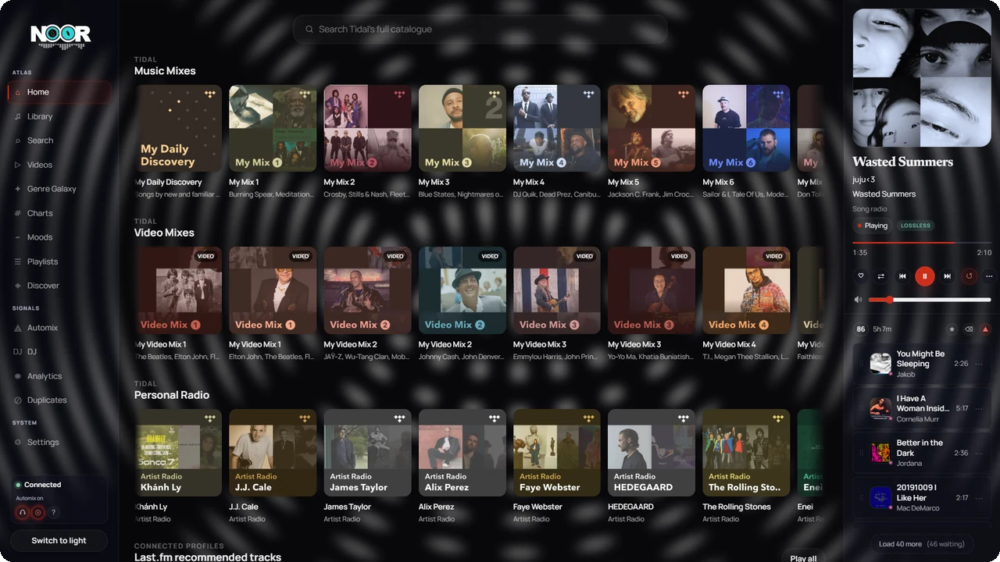
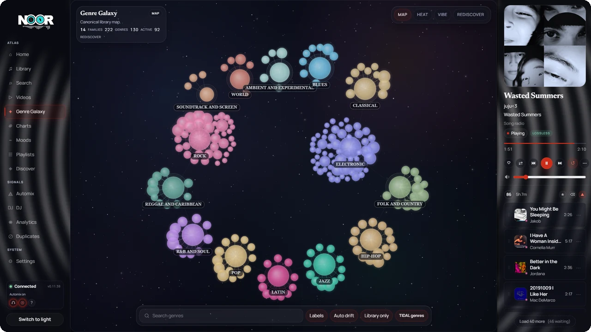
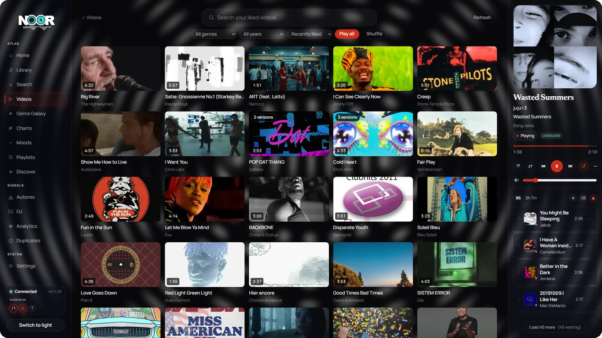
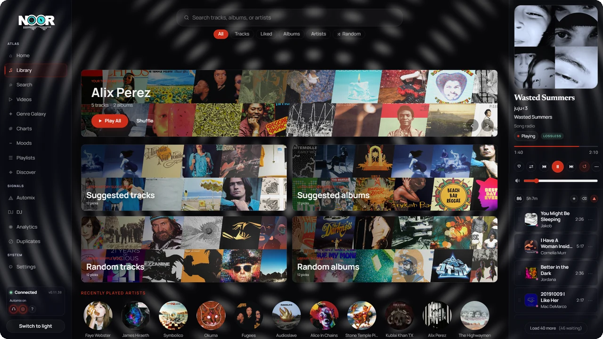
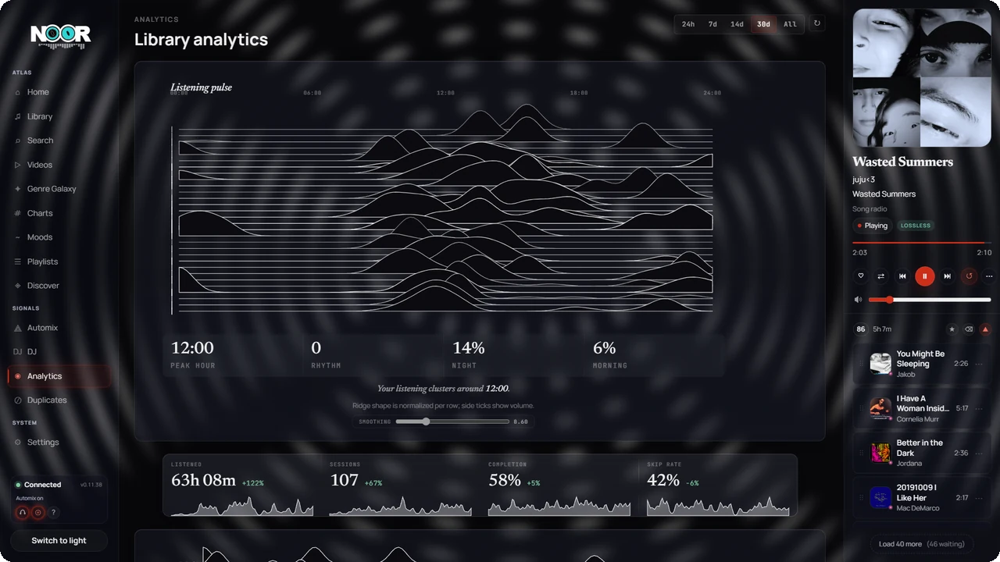

# NOORwave

<p align="center">
  
</p>

<p align="center">
  <strong>Your TIDAL library, rebuilt into something you actually listen to.</strong>
</p>

<p align="center">
  Gapless lossless playback &middot; a galaxy map of your taste &middot; your music videos, indexed &middot; planned DJ transitions &middot; phone remote
</p>

<p align="center">
  <a href="../../releases/latest">Download</a> &middot;
  <a href="#connect-lastfm-seriously">Last.fm setup</a> &middot;
  <a href="#run-from-source">Run from source</a> &middot;
  <a href="#the-phone-in-your-pocket-is-the-remote">Phone remote</a> &middot;
  <a href="#where-this-actually-is">Project status</a>
</p>

<p align="center">
  
  
  
  
  
</p>

## Why this exists

Streaming apps are built for browsing a catalogue. They are not built for the person who has thousands of tracks saved and wants to *listen*: to know what they own, to move through it fast, to have one record land on the next without a hole in the middle.

NOORwave is that second thing. It pulls your TIDAL library down into a SQLite database on your own machine, then builds a real desktop player on top of it. Search answers instantly because it never leaves your disk. The queue is something you shape, not something that happens to you. Transitions are planned instead of stumbled into. And your own taste becomes a map you can fly through.

TIDAL stays the source of the audio. Everything else, the library, the play history, the audio analysis, the learned similarity, lives on your machine and belongs to you.

<p align="center">
  
</p>

## The parts worth showing up for

### Gapless is the baseline, not a checkbox

A `NearEnd` event fires 15 seconds before a track ends so the next one is already decoded and buffered when the current one runs out. On every transition the output stream is rebuilt to match the source sample rate, so a 96 kHz record plays at 96 kHz instead of being quietly resampled to whatever the device was last set to. On Windows, NOORwave drives WASAPI in exclusive mode directly, which means the OS mixer is out of the path entirely. Crossfade, DASH segment seek, media keys, and tray transport are all in the core player rather than bolted on.

### Genre Galaxy

Your library, drawn as gravity. Fourteen families, a couple hundred genres, sized by how much of it you own and how much of it you actually play. Fly in, click a cluster, and start a session from it. Four lenses on the same map: **Map** for structure, **Heat** for what you have been playing, **Vibe** for mood, and **Rediscover** for the corners you have not touched in months. Toggle between your library's genres and TIDAL's, with auto drift on or off.

<p align="center">
  
</p>

### Your music videos, indexed

Two halves, and the second one is the interesting half.

**Discovery** is what you expect: search TIDAL's full video catalogue, play it in-app over HLS with a quality selector, autoplay through results, and pull in TIDAL's video mixes.

**Library indexing** is the part no other client does. A background pass walks the artists in your library and asks TIDAL what videos exist for the tracks you have liked, then keeps every hit. Not deduped down to one canonical clip: live takes, covers, and alternate cuts are all kept on purpose, because a richer wall beats a tidy one. Four different videos titled "Jamming" get told apart by release year and runtime. The result is a filterable wall of videos *for music you already love*, sortable by genre, year, and recency, with Play all and Shuffle across the lot. When a match is wrong, hide it once and it stays hidden through the 90-day re-scan.

<p align="center">
  
</p>

### Transitions that are planned, not hoped for

The DJ cockpit is a control surface, not a crossfade slider. It reads the outgoing and incoming tracks as profiles, plans the transition ahead of time, and shows you the plan: the transition lane, the waveform of the pair, the mix intent (faster, balanced, neutral), and the guardrails that will veto a move it cannot land cleanly. Harmonic and BPM matching run off real analysis: Camelot key detection via chromagram and Krumhansl-Schmuckler, tempo, energy. Compatible keys get favoured, clashes get penalised, and when a track has not been analysed yet the scoring stays neutral instead of guessing.

### Automix that learns *your* library

Automix keeps a running runway of tracks ahead of you and tells you why each one is there. It prefers learned neighbours from an embedding model trained on your own listening history, penalises hub tracks so the same twenty songs do not leak into every genre, and falls back to a session taste profile when the model has nothing to say. Clear the queue by hand and it backs off for a minute instead of immediately refilling what you just deleted. Four shuffle modes sit on a separate axis: plain, weighted by favourites and recency, genre-bucketed, and harmonically stabilised.

### The phone in your pocket is the remote

There is a full PWA at `/remote`, served by the same process on the same port. No companion app, no second service, no cloud round trip. Open it on your phone on the same Wi-Fi and you get transport, the live queue, search, artist and album browsing, action sheets, and a sleep timer. Add it to your home screen and it behaves like a native remote. This is the actual reason the backend is a real HTTP server instead of collapsing into Tauri IPC.

### A library that behaves like a local collection

Incremental TIDAL sync, instant local search, artist and album pages, playlists, duplicate detection, and metadata enrichment from MusicBrainz, Last.fm, and Discogs. Anything you want on disk, you can have on disk: right-click a track, album, or playlist and save it as bit-perfect FLAC or 320 kbps MP3, tagged, into an `Artist/Album/NN - Title` tree you pick once.

<p align="center">
  
</p>

### Listening analytics that are about listening

Not a year-end slideshow. A ridgeline of when you actually listen across the day, peak hour, session count, completion rate, skip rate, and how all of it has moved over 24 hours, 7 days, 14 days, 30 days, or all time.

<p align="center">
  
</p>

## Connect Last.fm. Seriously.

**This is the single highest-value thing you can do after signing into TIDAL.** NOORwave works without it, but a meaningful slice of what makes it interesting is dark until you connect it.

With a Last.fm API key in place you get:

- **Genre tags across your whole library.** This is what fills in Genre Galaxy, the genre shuffle mode, and genre-aware automix. Without it, large parts of the map are empty.
- **Similar-track radio.** Last.fm similarity is the producer behind the radio queue. Song radio and artist radio get much better reach.
- **Trending and charts data.**
- **Scrobbling** to your Last.fm profile, once you add the shared secret as well.

It also compounds: the more your library is tagged and the more listening history accumulates, the better the learned similarity model gets, which is what automix and discovery lean on.

How to set it up:

1. Create an API account at [last.fm/api/account/create](https://www.last.fm/api/account/create). It takes about a minute and is free.
2. In NOORwave, go to **Settings -> Sources -> Last.fm** and paste the API key. Add the shared secret too if you want scrobbling.
3. Run the enrichment pass from the same panel. It is resumable and shows progress. Leave it running while you listen.

No Last.fm key ships with the app, so this step is on you. It is worth the minute.

## Download

Latest build: [GitHub Releases](../../releases/latest).

| Platform | Artifact | Notes |
|---|---|---|
| Windows | `NOORwave-vX.Y.Z-windows-x64-setup.exe` | Per-user installer, updates in place. Recommended. |
| Windows | `NOORwave-vX.Y.Z-windows-x64.zip` | Portable. Unzip anywhere, run `NOORwave.exe`. |
| macOS ARM64 | `NOORwave-vX.Y.Z-macos-arm64.tar.gz` | Portable. Gatekeeper may need `xattr -cr NOORwave noor-server`. |
| macOS x64 | `NOORwave-vX.Y.Z-macos-x64.tar.gz` | Portable. |
| Linux x64 | `NOORwave-vX.Y.Z-linux-x64.tar.gz` | Portable. |

Windows builds are not CA-signed yet, so SmartScreen can warn on first launch. The updater payload itself is signed with the project's Tauri updater key.

## Run From Source

You need Rust stable, Node 24, pnpm 10, and a TIDAL account (you sign in from inside the app).

Fastest path, backend and frontend together:

```powershell
.\scripts\dev.ps1
```

Or run them yourself:

```powershell
cargo run -p noor-server
```

```powershell
cd frontend
pnpm install
pnpm dev
```

- **Dev server with hot reload:** `http://127.0.0.1:17601`
- **Backend-served production UI:** `http://127.0.0.1:17600`

For the full desktop shell, which launches the server for you and adds the tray, media keys, and updater:

```powershell
cargo run -p noor-app
```

On first run the server prints an access PIN in its startup banner. On loopback the UI fetches it automatically, so you never type it on the desktop. You only need it on a phone. It is always readable again in **Settings -> Access PIN**.

## The Phone Remote, Set Up

1. **Make the server reachable on your LAN.** Desktop app: tray icon -> **Network access**. Standalone server: run with `--host`.
2. **Find the desktop's LAN IP** (`ipconfig` on Windows), for example `192.168.1.42`.
3. **On the phone, same Wi-Fi, open** `http://192.168.1.42:17600/remote`.
4. **Enter the access PIN** from **Settings -> Access PIN**. The phone caches it, so this is once per device.
5. Optional: "Add to Home Screen" to install it as a standalone PWA.

Windows may show a firewall prompt the first time the server binds to the LAN. Allow it on private networks. Regenerating the PIN disconnects every device. There is no QR pairing yet, you type the URL and PIN by hand.

## Configuration

### Ports

| Port | What | Default | Override |
|---|---|---|---|
| Backend | `noor-server` HTTP, WebSocket, and the `/remote` PWA | `17600` | `NOOR_PORT` |
| Dev server | Vite frontend during `pnpm dev` | `17601` | `NOOR_DEV_PORT` |

The backend port is baked into the frontend at build time. If you change `NOOR_PORT`, rebuild the frontend so the UI points at the right place. The dev-server port is the only origin the backend trusts for CORS in dev, so keep it in sync on both sides.

### Bind address

The server listens on `127.0.0.1` by default, so nothing off your machine can reach it. To expose it on your LAN, use the tray's **Network access** toggle, pass `--host`, or set `NOOR_ADDR=0.0.0.0:17600`.

Precedence, highest first: `NOOR_ADDR` > `--host` > the saved Network-access setting > loopback.

### Environment variables

All optional. The app ships with working defaults, including built-in TIDAL credentials.

| Variable | Purpose |
|---|---|
| `NOOR_PORT` | Backend listen port. Rebuild the frontend after changing. |
| `NOOR_DEV_PORT` | Vite dev-server port, and the trusted CORS origin in dev. |
| `NOOR_ADDR` | Full `host:port` bind address. Overrides `NOOR_PORT` and `--host`. |
| `NOOR_DB` | Path to the SQLite database file. |
| `NOOR_DATA_DIR` | Base data directory (database, token) for installed builds. |
| `NOOR_WWW_DIR` | Directory of the built frontend to serve. |
| `LASTFM_API_KEY` / `LASTFM_API_SECRET` | Last.fm, if you prefer env vars to the Settings panel. The secret enables scrobbling. |
| `TIDAL_CLIENT_ID` / `TIDAL_CLIENT_SECRET` | Override the built-in TIDAL app credentials. |
| `TIDAL_PKCE_CLIENT_ID` / `TIDAL_PKCE_CLIENT_SECRET` | Override the TIDAL PKCE login credentials. |
| `DISCOGS_TOKEN` / `DISCOGS_USER_AGENT` | Discogs label and release metadata. |
| `SPORTIFY_API_BASE_URL` | Override the Sportify metadata proxy base URL. |

A few cache-tuning knobs exist (`DISCOVERY_CACHE_TTL_DAYS`, `RESOLVE_CACHE_TTL_DAYS`, `RESOLVE_RETRY_AFTER_DAYS`, `RESOLVE_EAGER_N`, `RESOLVE_BULK_CONCURRENCY`). Defaults are fine.

## How It Is Built

```text
noor-app       Tauri 2 desktop shell: tray, media keys, updater, sidecar manager
noor-server    Rust Axum server: SQLite, audio engine, integrations, WebSocket events
frontend       SvelteKit 2 + Svelte 5 UI, static build served by noor-server
docs           Specs, plans, inventories, design memory
scripts        Build, dev launcher, smoke tests, data utilities
```

- **Sidecar model.** The Tauri shell spawns `noor-server` as a child process, waits for `GET /api/ping`, then opens the WebView. Shutdown goes through `POST /api/shutdown` before any force kill.
- **One server, two front doors.** The same process serves the desktop UI and the LAN `/remote` PWA. That is why it stays a real HTTP server.
- **Auth.** One shared bearer token (the access PIN) gates every protected route: a header for `/api/*`, a query param for `/ws`, because browsers cannot set headers on a WebSocket upgrade.
- **Storage.** One local SQLite file. No account, no cloud, no sync.

Verify a change:

```powershell
cargo test --workspace --locked
```

```powershell
cd frontend
pnpm check
pnpm test
pnpm run build
```

Release mechanics live in [docs/release-checklist.md](docs/release-checklist.md).

## Where This Actually Is

**Late-stage work in progress, built by one person.**

It is not a demo. It is the player I use every day, and it is stable enough that the daily-driver path (sync, search, queue, gapless playback, remote) is genuinely solid. But it is also one developer's project moving fast, and it shows in places.

What that means for you:

- Rough edges land and get fixed quickly. Expect frequent releases.
- Genre Galaxy works and is a lot of fun, but interaction and rendering polish is ongoing.
- Windows is the priority platform. WASAPI exclusive output is the most tuned path by a wide margin. macOS and Linux build and run, but portable-only and less exercised.
- ACRCloud audio fingerprinting is scaffolded, not finished.
- This is a single-user local app. There is no hosted mode, no multi-user auth, no quotas.
- Some panels are further along than others. If something looks unfinished, it probably is.

Bug reports are genuinely useful. Screenshots and the version string from the sidebar help a lot.

## Contributing

Small, focused changes. Rust, Svelte, and TypeScript are the first-class languages. Do not commit local databases, build output, secrets, signing keys, or machine-local config.

```powershell
cargo fmt --all -- --check
```

To refresh the screenshots in this README, with `noor-server` running:

```powershell
node scripts/capture-screenshots.mjs
```

```powershell
python scripts/polish-screenshots.py
```

The first captures the five surfaces off the live app at 1920x1080. The second downscales them and rounds the corners into `docs/assets/shots/`.

## Disclaimer

NOORwave uses TIDAL's unofficial API through PKCE OAuth2. It is not affiliated with, endorsed by, or associated with TIDAL Music AS or MQA Ltd. Credentials are stored locally, encrypted, in SQLite. Intended for personal use only.

## License

[MIT](LICENSE)
