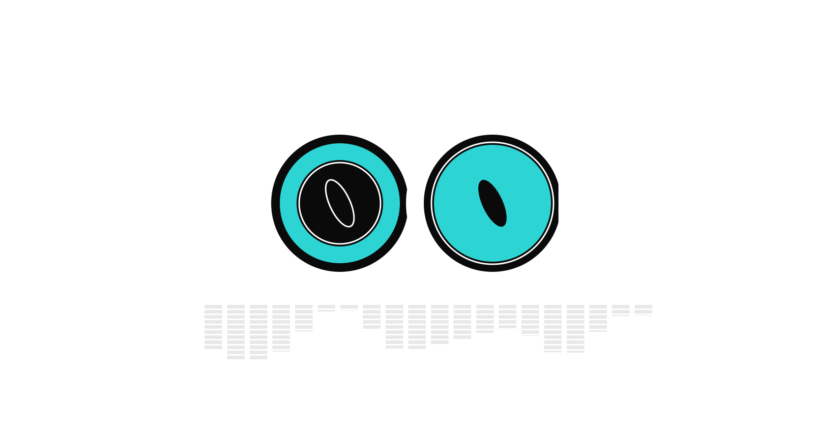
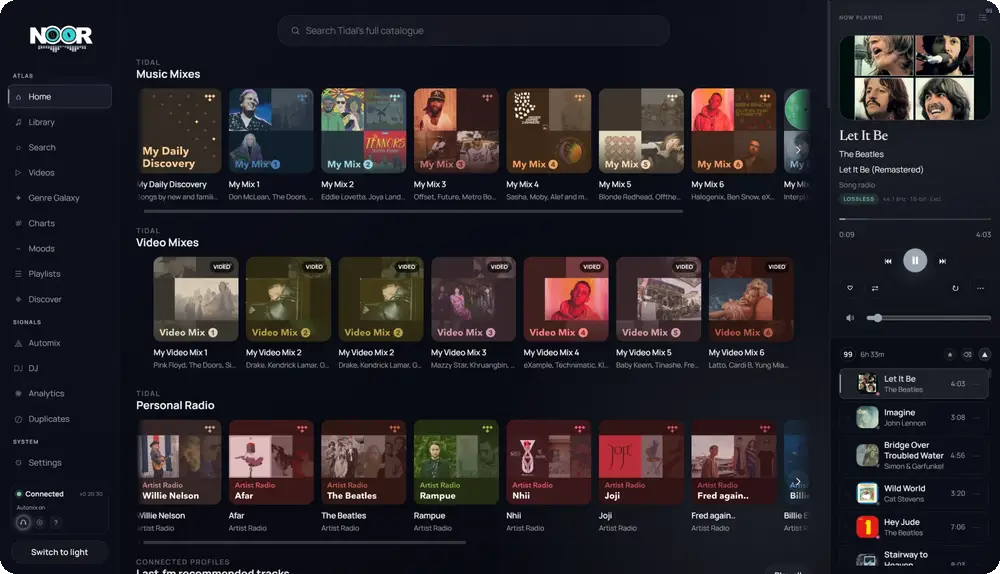
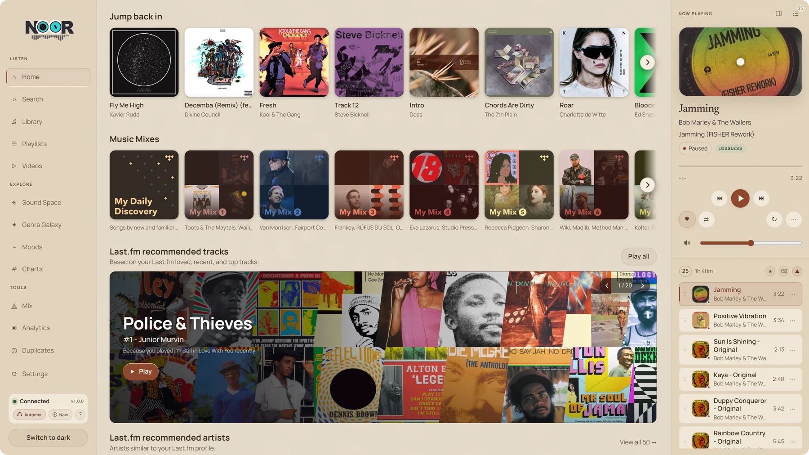
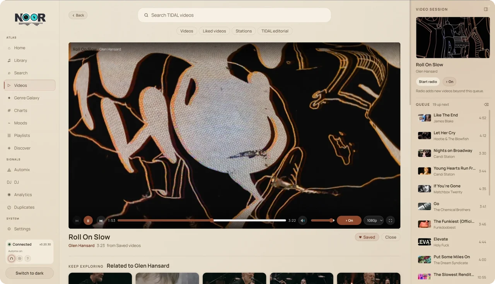
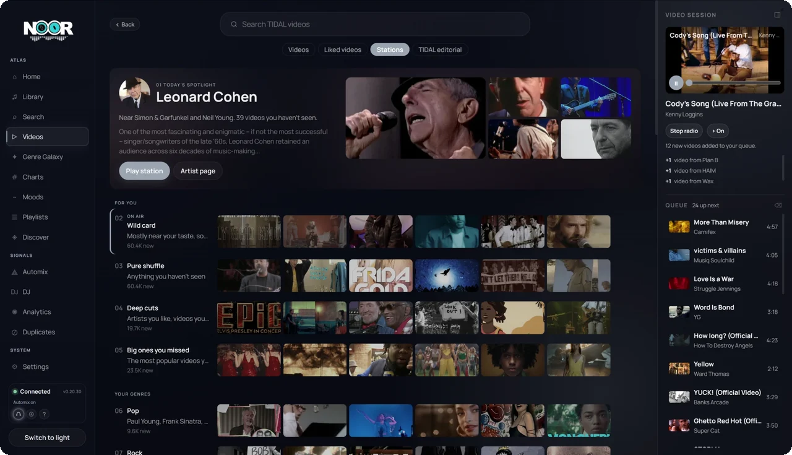
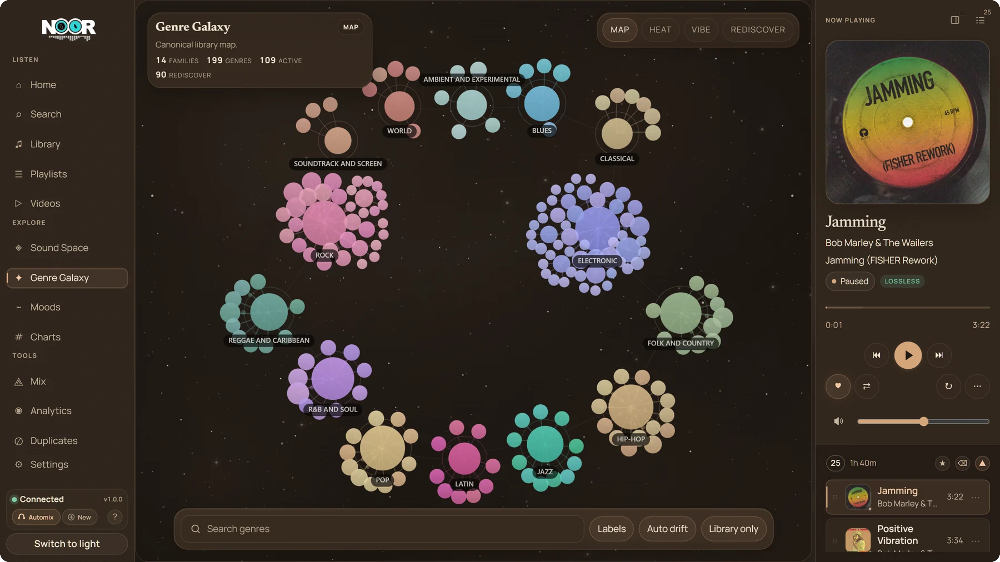
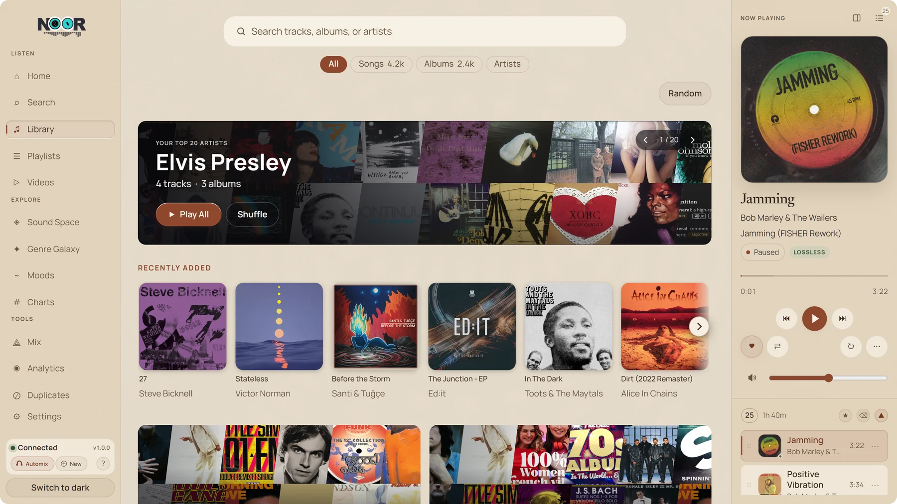
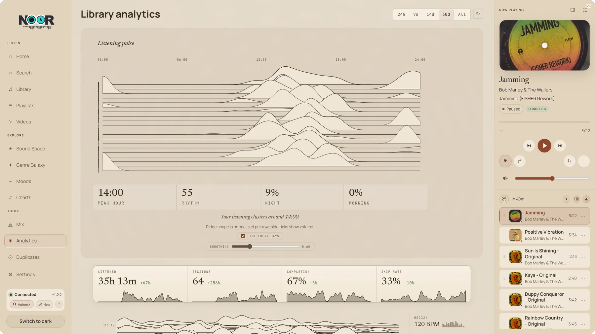

# NOORwave

<p align="center">
  
</p>

<p align="center">
  <strong>Your TIDAL library at local speed. Every music video for the songs you love. Your genres, drawn as a galaxy.</strong>
</p>

<p align="center">
  <a href="../../releases/latest"><strong>Download</strong></a> &middot;
  <a href="#connect-lastfm-seriously">Last.fm setup</a> &middot;
  <a href="#run-from-source">Run from source</a> &middot;
  <a href="#the-phone-remote-set-up">Phone remote</a> &middot;
  <a href="#where-this-actually-is">Project status</a>
</p>

<p align="center">
  
  
  
  
  
</p>

<p align="center">
  
</p>

## Why this exists

Streaming apps are built for browsing a catalogue. NOORwave is built for the person with thousands of saved tracks who wants to *listen*.

It pulls your TIDAL library into SQLite on your own disk and puts a real desktop player on top. Search never leaves your machine. The queue is yours to shape. Transitions are planned. Your taste becomes a map you can fly through.

TIDAL supplies the audio. The library, play history, audio analysis, and learned similarity live on your machine and belong to you.

## What you get

| | |
|---|---|
| **Instant everything** | Your library lives in local SQLite. Search, filters, and pages answer before you lift your finger. |
| **Every music video, indexed** | Live takes, covers, and alternate cuts for the songs you already love, plus video stations that never run dry. |
| **Genre Galaxy** | Your library drawn as gravity. Fly in, click a cluster, start a session. |
| **Gapless, bit-perfect** | Next track pre-buffered 15s out. Output follows the source sample rate. WASAPI exclusive on Windows. |
| **Planned DJ transitions** | Cues, blends, and bass swaps planned from beat, phrase, and key analysis. |
| **Automix that learns** | An embedding model trained on *your* listening keeps the runway full and tells you why. |
| **Make it yours** | Dock the player left, right, or bottom. 25+ colour schemes, light or dark, 50+ animated backgrounds that move to the beat. |
| **Phone remote** | Scan a QR code. Your phone is the remote. No app store, no cloud. |

## Speed is the feature

Your whole TIDAL library is mirrored into a SQLite database on your disk. Search runs locally, so results land as you type: no spinner, no round trip, no rate limit. Artist pages, album pages, filters, and shuffle all read from the same local copy. Sync is incremental, so keeping it fresh costs seconds, not minutes.

<p align="center">
  <picture>
    <source media="(prefers-color-scheme: dark)" srcset="docs/assets/shots/home-dark.webp" />
    
  </picture>
</p>

## Your music videos, indexed

**This is the part no other TIDAL client does.**

A background pass walks the artists in your library and asks TIDAL for every video tied to the tracks you have liked, then keeps all of them. Live takes, covers, acoustic sessions, alternate cuts: nothing is deduped down to one canonical clip, because a rich wall beats a tidy one. Four videos called "Jamming" get told apart by year and runtime. Filter by genre, year, and recency, then Play all or Shuffle. Hide a bad match once and it stays hidden through every re-scan.

It plays in-app over HLS with a quality picker, a video session queue, and **Keep exploring** rows of related artists under every clip. You can still search TIDAL's full video catalogue and play its video mixes.

<p align="center">
  <picture>
    <source media="(prefers-color-scheme: dark)" srcset="docs/assets/shots/video-warm.webp" />
    
  </picture>
</p>

### Video stations that keep playing

**Videos -> Stations** serves a daily lineup: an artist spotlight, a wild card, deep cuts, big ones you missed, and a station for each of your genres. Every station shows how many videos you have not seen yet, and refills as you watch, steered by artist relationships and what you actually finish.

Behind it, a crawler maps the artist graph outward from your liked artists, so the catalog keeps growing on its own. Dial it in **Settings -> Services -> TIDAL -> Video discovery**: **Full**, **Limited** (about a tenth of the requests), or **Off**.

<p align="center">
  
</p>

## Genre Galaxy

Your library as a star map. Fourteen genre families, nearly two hundred genres, each sized by how much you own and how much you play. Fly in, click a cluster, and a session starts from it.

Four lenses on the same sky: **Map** for structure, **Heat** for what is on rotation, **Vibe** for mood, **Rediscover** for the corners you forgot. Flip between your library's genres and TIDAL's, and let **Auto drift** wander for you.

Genre runs through everything else too: a genre shuffle mode, genre-aware automix, genre video stations, and tags from MusicBrainz and Last.fm stitched into one taxonomy.

<p align="center">
  
</p>

## Make it yours

<p align="center">
  
</p>

- **Dock the player** on the right, the left, or as a bar along the bottom. On narrow windows it folds into a mobile layout.
- **25+ colour schemes** (Iris, Clay, Ember, Abyss, Neon, Obsidian, and more), each in light, dark, or following your system.
- **50+ animated backgrounds**: aurora ribbons, liquid chrome, spiral galaxies, stained glass, synthwave, live spectrum analysers. They pulse to the music, bend toward your cursor, and can take their colours from the album art.

Every screenshot in this README follows your GitHub theme. Flip it and watch them change.

## The rest of the player

### Gapless is the baseline

A `NearEnd` event fires 15 seconds before a track ends, so the next one is decoded and waiting. Every transition rebuilds the output stream at the source rate: a 96 kHz record plays at 96 kHz, never quietly resampled. On Windows, NOORwave drives WASAPI exclusive mode directly and takes the OS mixer out of the path. Crossfade, DASH seek, media keys, and tray transport are all core.

### Transitions that are planned, not hoped for

The DJ cockpit reads both tracks as audio profiles and plans cues, duration, and gain ahead of time. Blends, cuts, bass swaps, and energy changes lean on beat, phrase, and Camelot key evidence. Pick **Conservative**, **Balanced**, or **Adventurous**. When analysis is unsure, it falls back to a clean crossfade. **Why this transition?**, **Fine Tune**, and **Diagnostics** show the reasoning.

### Automix that learns *your* library

Automix keeps a runway of tracks ahead and explains each pick. It prefers neighbours from an embedding model trained on your own history, penalises hub tracks so the same twenty songs do not leak everywhere, and backs off for a minute after you clear the queue by hand. Shuffle has four modes: plain, weighted, genre-bucketed, and harmonically stabilised.

### The phone in your pocket is the remote

A full PWA at `/remote`, served by the same process. Scan a one-use QR code in **Settings -> Remote -> Phone remote** and you get transport, the live queue, search, browsing, and a sleep timer. Add it to your home screen and it feels native. Same LAN only, no cloud relay.

### A library that feels local

Artist and album pages, playlists, duplicate detection, and enrichment from MusicBrainz, Last.fm, and Discogs. Right-click anything to save it as bit-perfect FLAC or 320 kbps MP3, tagged into an `Artist/Album/NN - Title` tree.

<p align="center">
  <picture>
    <source media="(prefers-color-scheme: dark)" srcset="docs/assets/shots/library-dark.webp" />
    
  </picture>
</p>

### Analytics about listening

Not a year-end slideshow. A ridgeline of when you listen through the day, peak hour, sessions, completion, and skip rate, over 24 hours to all time. Here with the player docked along the bottom.

<p align="center">
  <picture>
    <source media="(prefers-color-scheme: dark)" srcset="docs/assets/shots/analytics-warm.webp" />
    
  </picture>
</p>

## Connect Last.fm. Seriously.

**This is the single highest-value thing you can do after signing into TIDAL.** NOORwave works without it, but a meaningful slice of what makes it interesting is dark until you connect it.

With a Last.fm API key in place you get:

- **Genre tags across your whole library.** This is what fills in Genre Galaxy, the genre shuffle mode, and genre-aware automix. Without it, large parts of the map are empty.
- **Similar-track radio.** Last.fm similarity is the producer behind the radio queue. Song radio and artist radio get much better reach.
- **Trending and charts data.**
- **Scrobbling** to your Last.fm profile, once you add the shared secret as well.

It also compounds: the more your library is tagged and the more listening history accumulates, the better the learned similarity model gets, which is what automix and discovery lean on.

How to set it up:

1. Create an API account at [last.fm/api/account/create](https://www.last.fm/api/account/create). It takes about a minute and is free.
2. In NOORwave, go to **Settings -> Services -> Last.fm** and paste the API key. Add the shared secret too if you want scrobbling.
3. Run the enrichment pass from the same panel. It is resumable and shows progress. Leave it running while you listen.

No Last.fm key ships with the app, so this step is on you. It is worth the minute.

## Download

Latest build: [GitHub Releases](../../releases/latest). Read the [v0.19.47 release notes](docs/releases/v0.19.47.md) for this release's changes.

| Platform | Artifact | Notes |
|---|---|---|
| Windows | `NOORwave-vX.Y.Z-windows-x64-setup.exe` | Per-user installer, updates in place. Recommended. |
| Windows | `NOORwave-vX.Y.Z-windows-x64.zip` | Portable. Unzip anywhere, run `NOORwave.exe`. |
| macOS ARM64 | `NOORwave-vX.Y.Z-macos-arm64.tar.gz` | Portable. Gatekeeper may need `xattr -cr NOORwave noor-server`. |
| macOS x64 | `NOORwave-vX.Y.Z-macos-x64.tar.gz` | Portable. |
| Linux x64 | `NOORwave-vX.Y.Z-linux-x64.tar.gz` | Portable. |

Windows builds are not CA-signed yet, so SmartScreen can warn on first launch. The updater payload itself is signed with the project's Tauri updater key.

The Windows portable zip remains the recovery option if installation or updating is blocked. Installed app code lives under `%LOCALAPPDATA%\Programs\NOORwave`, with your database, settings and logs under `%LOCALAPPDATA%\NOORwave`.

## Run From Source

You need Rust stable, Node 24, pnpm 10, and a TIDAL account (you sign in from inside the app).

Fastest path, backend and frontend together:

```powershell
.\scripts\dev.ps1
```

Or run them yourself:

```powershell
cargo run -p noor-server
```

```powershell
cd frontend
pnpm install
pnpm dev
```

- **Dev server with hot reload:** `http://127.0.0.1:17601`
- **Backend-served production UI:** `http://127.0.0.1:17600`

For the full desktop shell, which launches the server for you and adds the tray, media keys, and updater:

```powershell
cargo run -p noor-app
```

On first run the server prints its master access PIN in the startup banner. On loopback the desktop UI fetches it automatically. Normal phone setup uses the QR flow in **Settings -> Remote -> Phone remote**; the master PIN remains available there under **Recovery: use the master PIN** for browsers that cannot pair.

## The Phone Remote, Set Up

In the installed desktop app:

1. Open **Settings -> Remote -> Phone remote** and enable **Allow phone remote**. Use this only on a trusted local network.
2. Optional: enable **Start NOORwave in the tray when I sign in** so the remote is available without opening the main window first.
3. Select **Show pairing QR**, then scan it with the phone's camera. If NOORwave is already installed on the phone's home screen, enter the temporary six-digit code instead. The QR and code expire after two minutes and work once.
4. Open the paired remote and optionally add it to the phone's home screen. The device receives its own persistent credential; the permanent master PIN is not embedded in the QR.
5. Back on the desktop, use **Paired devices** to rename or revoke individual phones. **Reset all remote access** rotates the master PIN and disconnects every remote session.

If the friendly `.local` address does not open, choose the direct Wi-Fi address under **Use a different connection address**, refresh the QR, and pair that origin separately. Windows may show a firewall prompt the first time LAN access is enabled; allow NOORwave on private networks. Guest Wi-Fi/client isolation and VPNs can prevent local devices from seeing one another.

For a standalone `noor-server`, run with `--host`, open `http://<LAN-IP>:17600/remote`, and use the master PIN. QR generation and paired-device management are deliberately restricted to the local desktop settings surface. Phone Remote is same-LAN only: it does not use a cloud relay, port forwarding, or internet discovery.

## Configuration

### Ports

| Port | What | Default | Override |
|---|---|---|---|
| Backend | `noor-server` HTTP, WebSocket, and the `/remote` PWA | `17600` | `NOOR_PORT` |
| Dev server | Vite frontend during `pnpm dev` | `17601` | `NOOR_DEV_PORT` |

The backend port is baked into the frontend at build time. If you change `NOOR_PORT`, rebuild the frontend so the UI points at the right place. The dev-server port is the only origin the backend trusts for CORS in dev, so keep it in sync on both sides.

### Bind address

The server listens on `127.0.0.1` by default, so nothing off your machine can reach it. To expose it on your LAN, use the tray's **Network access** toggle, pass `--host`, or set `NOOR_ADDR=0.0.0.0:17600`.

Precedence, highest first: `NOOR_ADDR` > `--host` > the saved Network-access setting > loopback.

### Environment variables

All optional. The app ships with working defaults, including built-in TIDAL credentials.

| Variable | Purpose |
|---|---|
| `NOOR_PORT` | Backend listen port. Rebuild the frontend after changing. |
| `NOOR_DEV_PORT` | Vite dev-server port, and the trusted CORS origin in dev. |
| `NOOR_ADDR` | Full `host:port` bind address. Overrides `NOOR_PORT` and `--host`. |
| `NOOR_DB` | Path to the SQLite database file. |
| `NOOR_DATA_DIR` | Base data directory (database, token) for installed builds. |
| `NOOR_WWW_DIR` | Directory of the built frontend to serve. |
| `LASTFM_API_KEY` / `LASTFM_API_SECRET` | Last.fm, if you prefer env vars to the Settings panel. The secret enables scrobbling. |
| `TIDAL_CLIENT_ID` / `TIDAL_CLIENT_SECRET` | Override the built-in TIDAL app credentials. |
| `TIDAL_PKCE_CLIENT_ID` / `TIDAL_PKCE_CLIENT_SECRET` | Override the TIDAL PKCE login credentials. |
| `DISCOGS_TOKEN` / `DISCOGS_USER_AGENT` | Discogs label and release metadata. |
| `SPORTIFY_API_BASE_URL` | Override the Sportify metadata proxy base URL. |

A few cache-tuning knobs exist (`DISCOVERY_CACHE_TTL_DAYS`, `RESOLVE_CACHE_TTL_DAYS`, `RESOLVE_RETRY_AFTER_DAYS`, `RESOLVE_EAGER_N`, `RESOLVE_BULK_CONCURRENCY`). Defaults are fine.

## How It Is Built

```text
noor-app       Tauri 2 desktop shell: tray, media keys, updater, sidecar manager
noor-server    Rust Axum server: SQLite, audio engine, integrations, WebSocket events
frontend       SvelteKit 2 + Svelte 5 UI, static build served by noor-server
docs           Specs, plans, inventories, design memory
scripts        Build, dev launcher, smoke tests, data utilities
```

- **Sidecar model.** The Tauri shell spawns `noor-server` as a child process, waits for `GET /api/ping`, then opens the WebView. Shutdown goes through `POST /api/shutdown` before any force kill.
- **One server, two front doors.** The same process serves the desktop UI and the LAN `/remote` PWA. That is why it stays a real HTTP server.
- **Auth.** The desktop loopback session is automatic. Phones normally receive individually revocable credentials through a one-use, two-minute pairing ticket; the shared master PIN remains a recovery fallback. Protected HTTP requests use a bearer header and WebSockets use a query credential because browsers cannot set headers on an upgrade.
- **Storage.** One local SQLite file. No account, no cloud, no sync.

Verify a change:

```powershell
cargo test --workspace --locked
```

```powershell
cd frontend
pnpm check
pnpm test
pnpm run build
```

Release mechanics live in [docs/release-checklist.md](docs/release-checklist.md).

## Where This Actually Is

**Late-stage work in progress, built by one person.**

It is not a demo. It is the player I use every day, and it is stable enough that the daily-driver path (sync, search, queue, gapless playback, remote) is genuinely solid. But it is also one developer's project moving fast, and it shows in places.

What that means for you:

- Rough edges land and get fixed quickly. Expect frequent releases.
- Genre Galaxy works and is a lot of fun, but interaction and rendering polish is ongoing.
- Windows is the priority platform. WASAPI exclusive output is the most tuned path by a wide margin. macOS and Linux build and run, but portable-only and less exercised.
- ACRCloud audio fingerprinting is scaffolded, not finished.
- This is a single-user local app. There is no hosted mode, no multi-user auth, no quotas.
- Some panels are further along than others. If something looks unfinished, it probably is.

Bug reports are genuinely useful. Screenshots and the version string from the sidebar help a lot.

## Contributing

Small, focused changes. Rust, Svelte, and TypeScript are the first-class languages. Do not commit local databases, build output, secrets, signing keys, or machine-local config.

```powershell
cargo fmt --all -- --check
```

To refresh the screenshots in this README, drop 2000-wide window captures into `docs/assets/raw/` named `<surface>-<theme>.webp` (for example `home-dark.webp`), then:

```powershell
python scripts/build-readme-tour.py
```

It crops the caption strip, rounds the corners into `docs/assets/shots/`, and bakes the rotating `tour.webp` and `themes.webp`.

## Disclaimer

NOORwave uses TIDAL's unofficial API through PKCE OAuth2. It is not affiliated with, endorsed by, or associated with TIDAL Music AS or MQA Ltd. Credentials are stored locally, encrypted, in SQLite. Intended for personal use only.

## License

NOORwave is source-available under the [PolyForm Noncommercial License 1.0.0](LICENSE). Personal, educational, research, hobby, and other non-commercial use is free. The license does not limit rights you may have under applicable law, including fair use.

Commercial use, managed hosting, redistribution, and OEM use require a separate commercial license from the copyright holder.

Earlier releases published under MIT remain available under their original terms.
